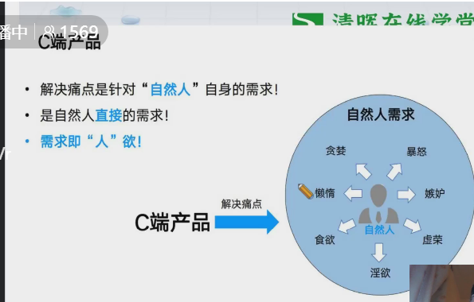

## 企业经营的三种模式

### 项目型

* 很辛苦
* 很难维持

### 产品型

### 运营型

* 电信、移动、联通、中石油

## 什么是产品

* 满足市场需求，被使用和消费的任何有形的物品和无形的服务

## 什么是项目

## 项目或项目失败的主要原因

## 关于产品的思考

## 产品的核心在于对需求的把握

* 好的产品描述能最大程度提高转化率

## 需求的重要性

* 需求是产品的根源

## 用户为何会产生需求

### 动因

* 2.环境压力
* 3.标杆效应

### 能力

## FAB 模型

### 俞军的产品价值公式

* 产品价值 = (先体验 - 旧体验) - 替代成本
  * 替代成本可包括认知成本、获取成本和使用成本

### 产品价值的提炼

### C端产品

### B端产品

### B端产品 VS C端产品

