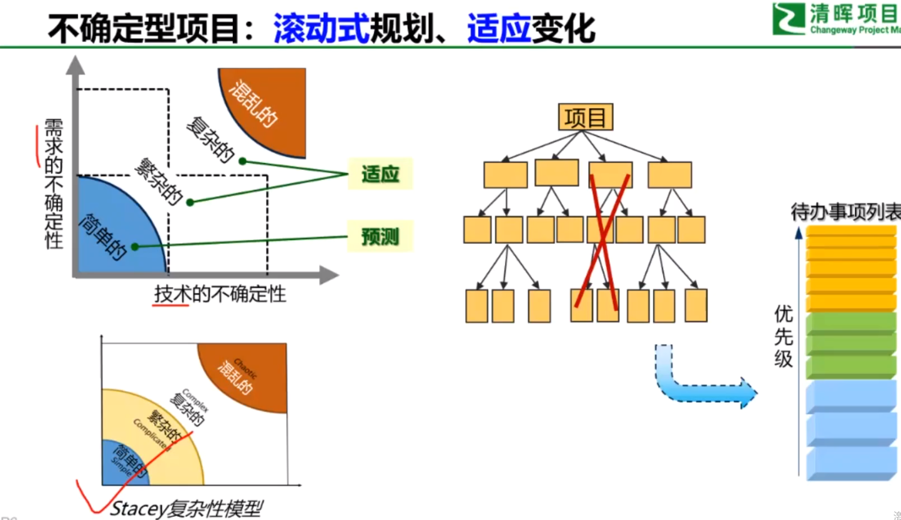
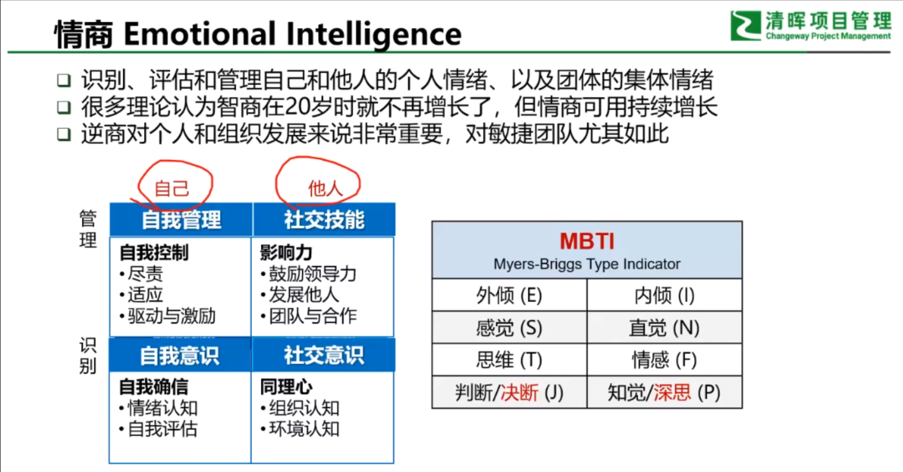
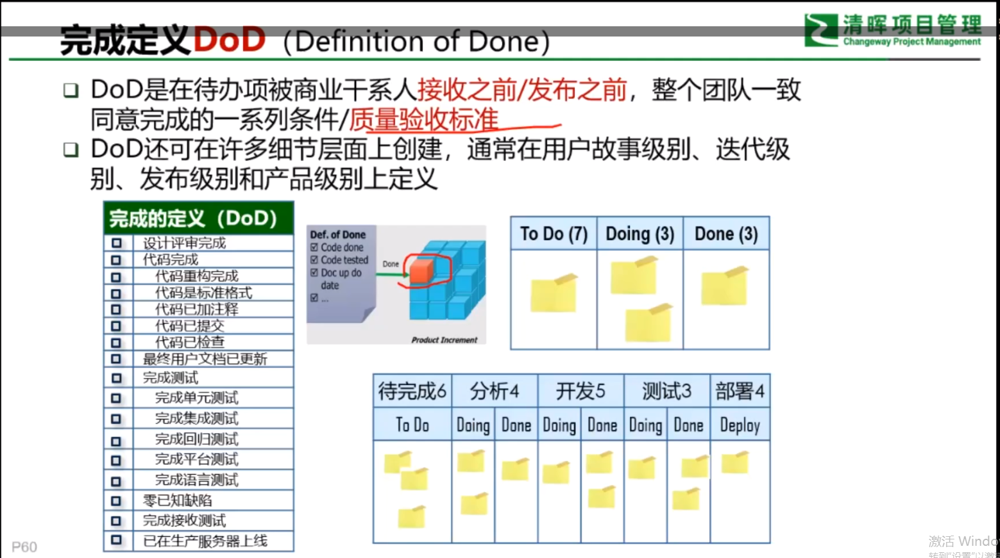
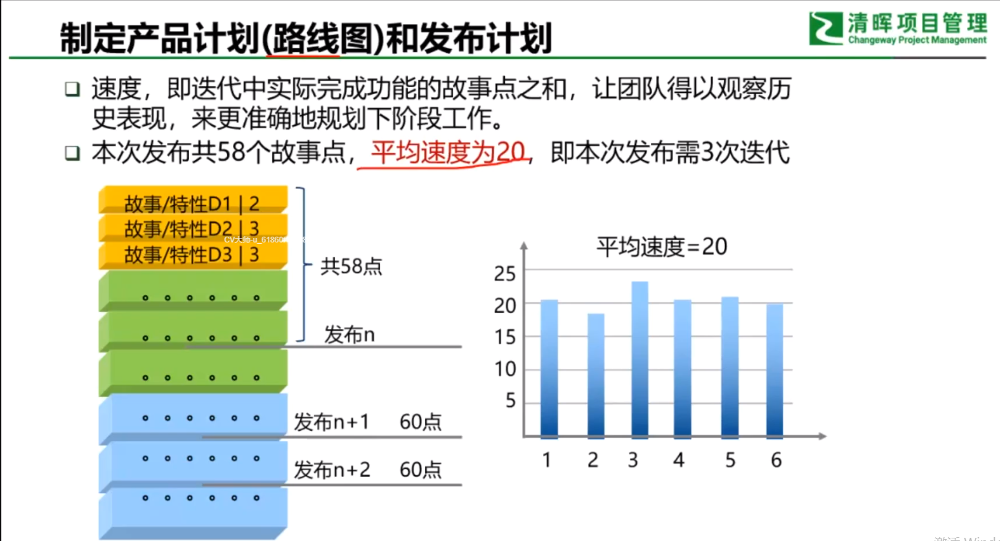
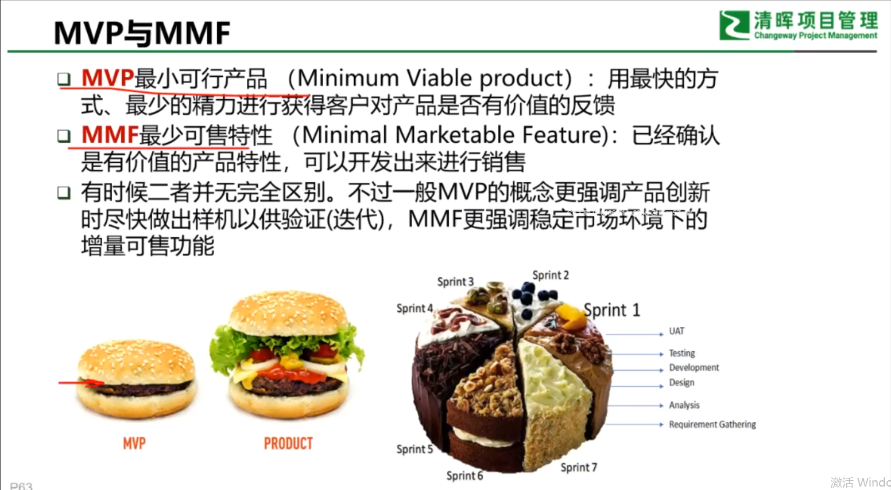
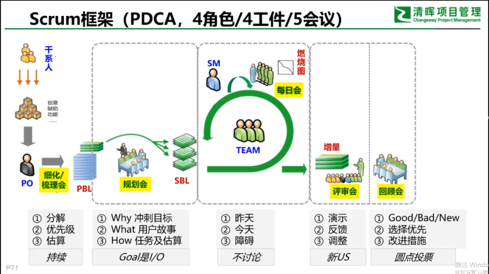
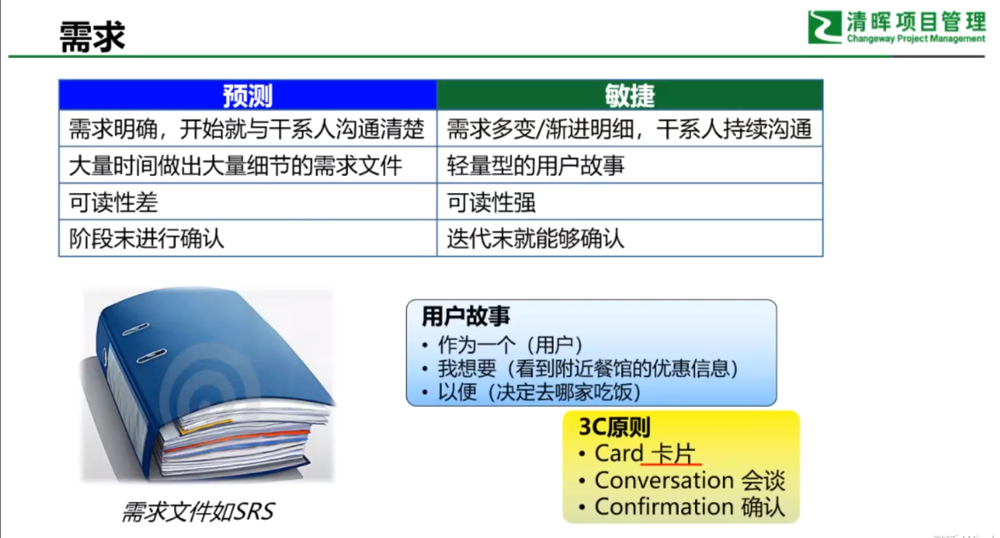
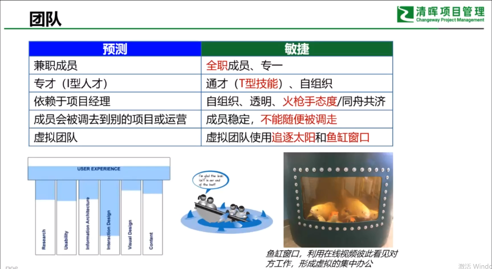

# 1.引言：瀑布与敏捷

# 2.敏捷宣言与原则

# 精益开发7原则

## 1 消除浪费

## 2 内建质量

## 3 创建知识(增强学习)

## 4 延迟决策

## 5 尽快交付

## 6 尊重成员

## 7 优化整体

# 3.Scrum框架
## 3.1 3355

### 3.1.1 3个角色

### 3.1.2 3个工件

### 3.1.3 5个会议

### 3.1.4 5个价值观

# 4. 敏捷角色与协作

# 5.产品规划与发布规划

# 6. 迭代管理

# 7. 敏捷和十大知识领域

# 8.多种敏捷方法

# 9. 敏捷适应性筛选

