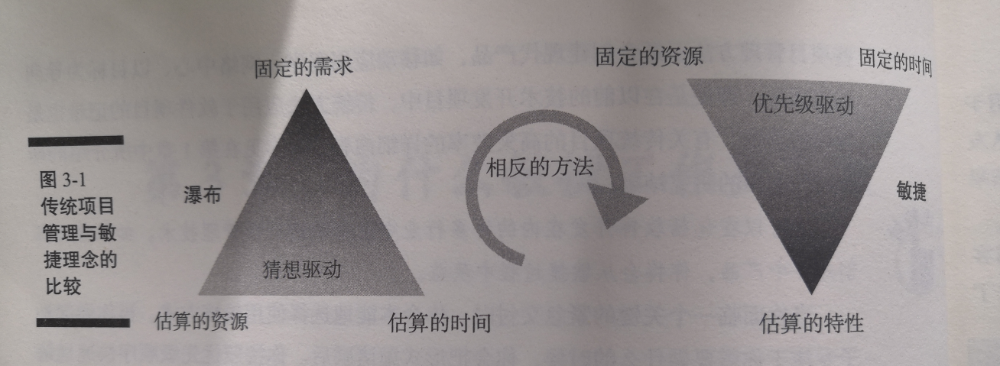
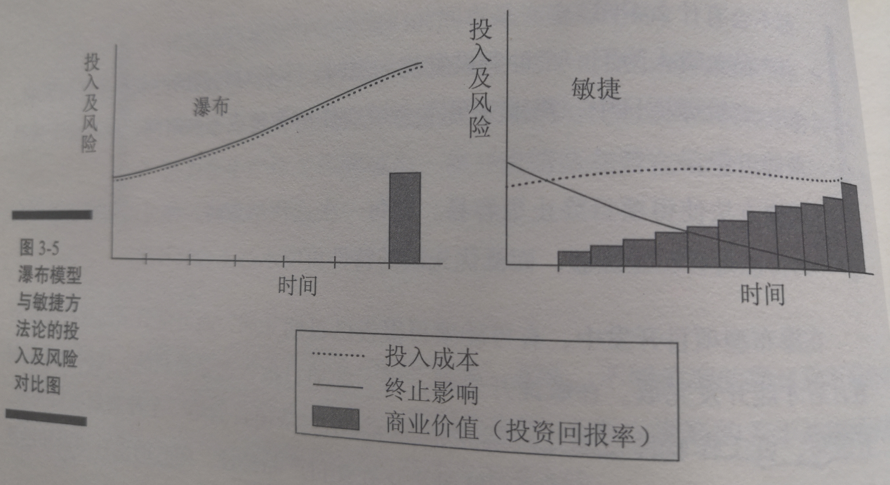

  
  
- [第三章 为什么敏捷工作更有效](#第三章-为什么敏捷工作更有效)
  - [评估敏捷方法的收益](#评估敏捷方法的收益)
  - [敏捷方法如何优于传统方法](#敏捷方法如何优于传统方法)
    - [优势](#优势)
  - [为什么大家喜欢敏捷](#为什么大家喜欢敏捷)
    - [高管层](#高管层)
    - [产品开发和客户：敏捷项目可以适应不断变化的需求，并产生更高价值的产品](#产品开发和客户敏捷项目可以适应不断变化的需求并产生更高价值的产品)
    - [管理层：](#管理层)
  
#  第三章 为什么敏捷工作更有效

##  评估敏捷方法的收益
  
* 可以在包括软件开发在内的许多行业中使用敏捷项目管理技术
* “棉花糖挑战”
  * 大爆炸式的开发，即经过过度规划后一次性完成所有的产品开发步骤，这种方法时`达不到`好效果的
  * `形式主义`和`单一的计划`往往会`阻碍成功`
* 传统与敏捷
  * 传统
    * 一个产品所有需求和交付全部被一次性锁定，结果是要么完全成功，要么完全失败
    * 一切取决于项目周期最后阶段的工作
    * 下一阶段依赖于前一阶段
    * 客户必须等到工程结束后才能获得产品每一个元素的最终交付
    * 客户在测试阶段才可以看见产品，此时投入已经很高，失败的风险也很高
  * 敏捷
    * 在一个`短的周期`中进行`开发`、`测试`和`发布`小的产品需求组，成为一个`迭代`
    * 在每次迭代中进行测试、寻找bug
    * 
    * 产品负责人、Scrum主管和冲刺是Scrum中的术语
      * Scrum是一种流行的用于组织工作的敏捷框架
      * Scrum鼓励团队像打橄榄球一样密切合作，并为结果承担责任
    * 敏捷项目中，客户可以在每一个短的周期看到他们的产品，给DevTeam代开了在早期确保价值最大化的机会
  
##  敏捷方法如何优于传统方法
  
* 优势
  * **更大的灵活性和稳定性**
  * **更少的非生产性工作**
  * **更快的高质量交付**
  * **更高的开发团队绩效**
  * **更严格的项目管控**
  * **更快的失败检测**
* 前提
  * `高素质的开发团队`
  * 敏捷方法强调的是如何支持开发团队，重视项目团队成员的行动及互动
  * 第一个核心价值：个体和互动高于流程和工具
  * 培养开发团队是敏捷项目管理的核心
* 敏捷项目团队组成
  * `开发团队`
    * 开发人员、测试人员、其他进行实际交付的工作人员
  * `项目干系人`
  * `产品负责人`
    * 是`产品和客户商业需求`方面的专家
    * 专注`商业客户和产品需求`的优先级
    * 通过为开发团队提供`产品说明`以及`最终的验收`来支持开发团队
  * `Scrum主管`
    * 作为开发团队和能使开发效率变慢的干扰因素之间的`缓冲剂`
    * 提供关于`敏捷过程`的专业知识，帮助`消除`阻碍开发团队前进的`障碍`
    * 负责`促进共识的建立`及`干系人`之间的`沟通`
###  优势
  
> 更大的灵活性和稳定性
* 项目开始时的两个挑战
  * 项目团队对`产品最终状态`的认知有限
    * 对产品知识和未来商业需求的有限了解，几乎注定了`项目变更`
  * 项目团队无法认知未来
* 敏捷框架是以`灵活性`为`基础`创建的
* 应用敏捷方法，项目团队能够`适应`在项目进程中出现的`新知识`和`新需求`
* 敏捷项目在`适应变更`方面非常强，因为变更的机制已经在日常进程中确立。
* 敏捷项目中的迭代能分割项目中的不同领域，提供独立的`稳定性`
* 敏捷项目团队习惯适应`待办列表`中的变更，一般不适应`冲刺期间`来自外部的变更(冲刺通常是稳定的)
* 通常，对于开发团队，`迭代`是最稳定的一个时间段。这种稳定性能导致`创新`的产生
* 敏捷项目管理提供一个稳定的`开发`、`反馈`和`变更`的周期，这使得项目团队既可以灵活地只开发那些适合的特性，还可以保持持续地创新
  
> 更少的非生产性工作(减少非生产性任务)
* 要完成一个项目，必须专注在`解决方案`上（这一点在传统项目里经常被忽视）
* 产品开发是一种需要持续关注的高强度工作，很多开发人员在正常工作日忙于其他类型的工作任务而不能获得足够的开发时间
  * 形成因果链：漫长的工作日 = 疲劳的开发人员 = 不必要的漏洞 = 更多的漏洞 = 延迟发布 = 实现价值需要更长时间
* 最大化工作效率的目标是消除加班并让开发人员在工作日专注于开发代码
* 减少非生产性的任务和时段
  * **会议**
    * 只包括`正式会议`：目标明确，有特定的主题和有限的时间
    * Scrum主管有责任`防止`开发团队的工作时间被非敏捷会议所破坏
    * 敏捷项目中，`项目状态`对整个组织都是`可视化的`，从而省掉会议状态的需求
  * **电子邮件**
    * 不是一个有效地沟通方式
    * 应该`面对面`沟通讨论
  * **专题展示**
    * 演示，而非展示
    * 展现软件是如何满足需求与达到验收标准的
    * 避免正式的幻灯片展示和相关的准备工作
  * **过程文档**
    * **使用迭代开发**
      * 敏捷团队通过`产品`和相关的`自动化测试`而非大量的文档来证明做出的决策
    * **一个规格不能适合所有项目**
      * 不需要为每个项目创建相同的文档，应该为特定的项目选择`所需要的文档`
    * **使用非正式的、灵活的文档工具**
    * **使用简易且能够提供足够信息的工具来管理项目进程**
      * 单纯地为了报告去创建特殊的项目进程报告✘
      * 敏捷团队使用`直观的图表`(如：燃尽图)来更快速地传达项目状态✔
  
> 更快的高质量交付(更高的质量，更快的交付)
* 传统
  * 客户在等待结果
  * 开发团队深陷编码
  * PM 要确保项目团队按计划执行，尽量阻止变更，并频繁提交详细的报告来更新结果
  * 测试开始，代码缺陷会导致预算增加、工期延误甚至毁掉整个项目
* 敏捷:敏捷项目管理的目标是`提供高质量的交付和快速的可应用代码`
  * 短期的迭代开发。
    * 限制特性的数量和复杂程度，使得已完成的交付物更容易测试
    * 每次冲刺指开发有限的特性
    * 将过于复杂的特性分解到多个冲刺中
  * DevTeam每天编写和测试代码，频繁构建版本，在整个项目过程中`维护可工作的产品`
  * 产品负责人参与每天的`问题解答`，并快速`澄清误解`
  * DevTeam处在`被激励状态`且拥有`合理的工作时间`
  * 代码`编写完成`后就进行`测试`——至少每天晚上进行一次
  * 使用现代工具写成测试脚本，`加速自动化测试`的进程
  * `客户`在每次`冲刺结束`时对`可工作`的特性进行`评审`
  
> 更高的开发团队绩效(提高团队绩效)
* **对团队的支持**：DevTeam`交付代码的能力`是使用敏捷方法的核心
  * 集中办公且靠近客户
  * 产品负责人可以实时地响应DevTeam的问题
  * SM 通过移除障碍，确保DevTeam能够专注于生成和实现生产效率最大化
* **专注**
  * DevTeam成员被`全职`分配在`一个项目`上，消除不同项目之间的转换而导致的时间和精力的损失
  * DevTeam成员们知道他们的`同事是完全可用的`
  * 开发人员专注于`与其他功能相独立的` `尽可能小的功能单元`
  * SM具有明确的责任保护开发人员`不受组织中其他事务的干扰`
  * 非生产性任务工作的减少`增加`了开发团队花费在`编码`和相关的`生产性`活动的`时间`
* **持续改进**
  * 每个新的迭代涉及一个全新的开始，`迭代开发`使得持续改进成为可能
  * 冲刺周期`短`，团队可以快速`融合变更`
  * 每次迭代结束的`回顾`会议，让Scrum团队成员讨论`具体的改进计划`
  * `整个`Scrum团队对`可能需要改进的工作内容`进行`评审`
  * Scrum团队将回顾中总结出来的经验教训应用到`下一次冲刺`，使生产变得更有效率
  
> 更严格的项目管控
* 工作效率的提升体现
  * 敏捷过程提供了持续的信息流：每天早上的Scrum会议规划工作并更新任务状态
  * 每个冲刺中，客户都有机会基于业务需求来更新产品需求的优先级
  * 每个冲刺结束交付可工作软件后，根据当前优先级去决定下一个迭代的工作量
  * 产品负责人为下一个冲刺设置优先级时，不会对当前的冲刺产生任何影响
    * 在一个敏捷项目中，需求变更不会增加任何管理成本和时间，也不会干扰当前的工作
  * 敏捷方法使得项目终止更容易
* 敏捷开发中
  * 每天的`项目报告`都是`最新`的
  * `代码`通常是`每日编写`
  * `可工作软件`每隔几周就能够进行`演示`
  * `每个成员`都知道团队`是否正在交付产品特性`
  * `即时的项目知识`和`迅速的优先级排序能力`创造了`高水平的项目控制能力`
  
> 更快的失败检测
* 更早和更频繁的检测故障的机会
* 每隔几周进行评估和采取行动的机会
* 失败成本的降低
  

  
##  为什么大家喜欢敏捷
  
###  高管层
  
* 效率
  * 敏捷开发团队是富有成效的。他们组织自己的工作，专注在开发工作上，受SM的保护不被打扰
  * 非生产活动被最小化
  * 使用简洁直观的工具显示项目进展情况
  * 通过持续的测试，及早检测和纠正缺陷
  * 当开发了解足够的功能后，敏捷项目就可以结束
* 更高更快的投资回报率
  * 软件能够尽早交付上市
  * 产品质量跟高
  * 收益机会加速
  * 项目能够实现自我创收
  
###  产品开发和客户：敏捷项目可以适应不断变化的需求，并产生更高价值的产品
  
* **提升对变更的适应**
  * 通过对`变更`高效的应对增加了`提升客户满意度`和`投资回报率`的机会
  * `变更`通常被顺利地纳入`后续迭代`中
  * 团队成员和冲刺周期保持不变，`项目问题少`。
  * DevTeam优先开发`最高价值的任务项`，产品负责人控制优先级，因此产品负责人能够确保`开发活动`与`业务优先级`的一致性
* **更大的价值**
  * 项目团队更早交付最高优先级的产品特性
  * 项目团队可以更早地交付完成的产品
  * 项目团队可以根据市场变化和客户反馈调整需求
  
###  管理层：
  
~~~
可以提供更高质量的软件，减少时间和精力的浪费，并通过清除列表中不确定有用的特性来强调产品价值
~~~
* 更高的质量
  * 通过`测试驱动开发`、`持续集成`、`客户对于可工作软件的频繁反馈`等技术，可以创造更高质量的产品
* 更少产品和过程的浪费
  * **准时制的开发**
    * 仅仅强调目前最高优先级的需求，意味着不花费时间在那些可能永远不会被开发的特性的细节上
  * **客户和干系人的参与**
    * 将客户和其他干系人的反馈整合到项目中
  * **对于面对面沟通的偏好**
    * 更快更清晰的沟通可节省时间并减少混乱
  * **建立在开发上的变更**
    * 只有高优先级的特性被开发
  * **对软件可工作性的强调**
    * 如果一个特性不工作或者不能以有价值的方式工作，那么它可以尽早的以较低成本被发现
* 强调价值
  * `更少`、`更短`、`更专注`的会议
  * `减少`形式主义
  * `刚好够`的文档
  * 客户和项目团队`共同`对产品的`质量`和`价值`负责
* 开发团队
  * 一个`明确的成功定义`（通过在需求开发期间共同指定冲刺目标和验收标准）
  * 独立组织开发活动的权力与尊重
  * 他们所需要的客户反馈，从而为产品`提供价值`
  * 专职SM的保护，清除障碍防止破坏
  * `人性化可持续`的工作步伐
  * `个性化发展`和`项目改进`的学习文化
  * 非编码时间`最小化`的结构
  
```text
在敏捷环境中，开发团队就是“达人”
```
  