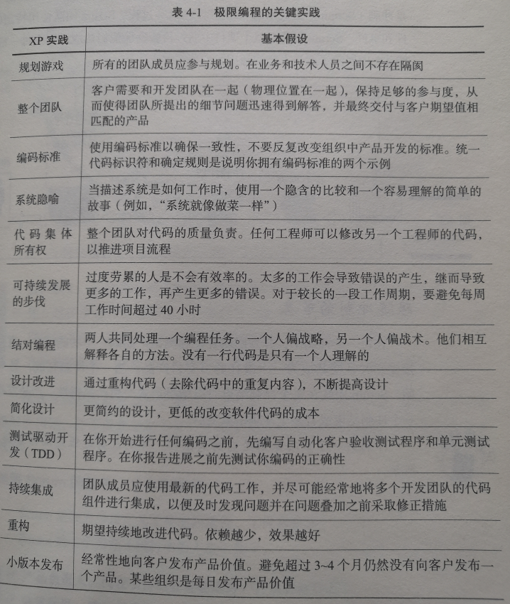
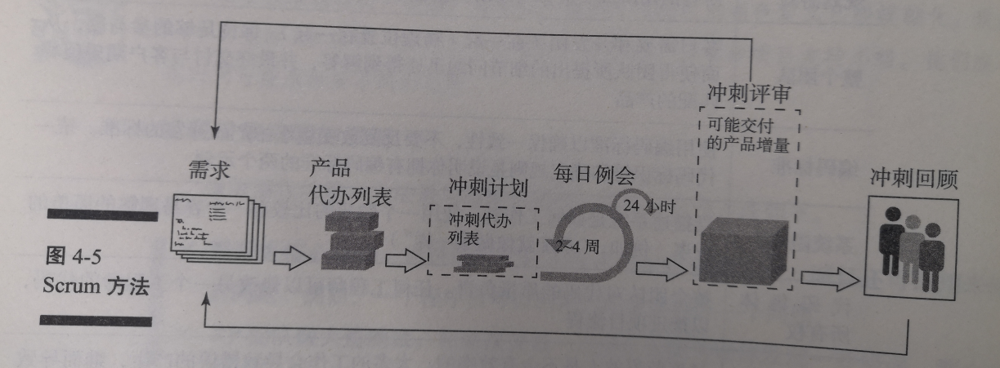
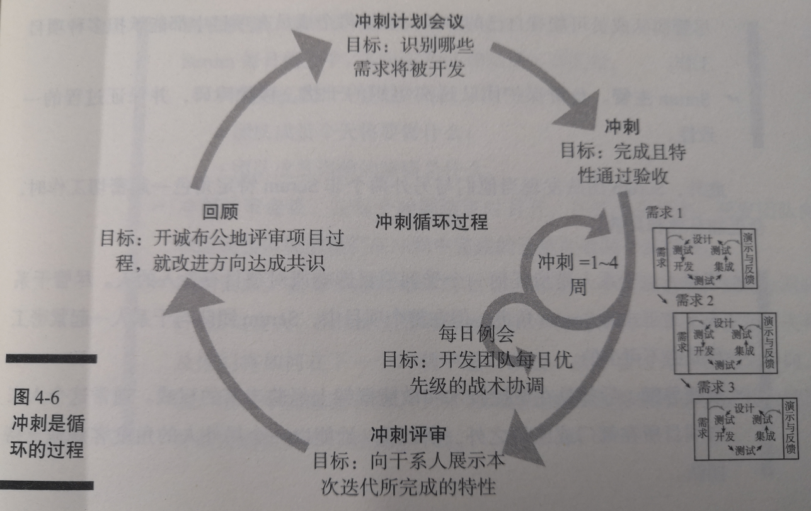

  
  
- [敏捷框架](#敏捷框架 )
  - [揭开敏捷方法的面纱](#揭开敏捷方法的面纱 )
  - [回顾三大方法：精益、极限编程和Scrum](#回顾三大方法精益-极限编程和scrum )
    - [概述](#概述 )
    - [了解精益和软件开发](#了解精益和软件开发 )
      - [精益原则](#精益原则 )
      - [使用精益来支持产品开发实践的方法](#使用精益来支持产品开发实践的方法 )
    - [概述](#概述-1 )
    - [原则](#原则 )
    - [实践](#实践 )
    - [概述](#概述-2 )
    - [跟随冲刺的节奏](#跟随冲刺的节奏 )
      - [理解 Scrum 的角色、工作和事件](#理解-scrum-的角色-工作和事件 )
  - [汇总](#汇总 )
  
#  敏捷框架
  
  
##  揭开敏捷方法的面纱
  
  
* 敏捷是一系列技术和方法的总称
* 敏捷的共性
  * **在多次迭代中开发，称为迭代开发**
  * **强调简洁、透明、因地制宜**
  * **跨职能、自组织团队**
  * **将可工作软件作为测量进度的标准**
* 敏捷项目管理是一种凭`经验主义`的项目管理方法
  * 经验主义理念：
    * **透明度**：开发过程中设计的每个人都理解该过程，并且能够为其改进作出贡献
    * **检验**：检验员定期检查产品，且具备发现偏离验收标准的技能
    * **调整**：为进一步减少产品偏差，开发人员必须能够迅速调整
* 常用的三种方法
  * `精益`：聚焦在结构
  * `极限编程`：关注结构，更关注开发实践，关注在技术设计、编码、测试和集成
  * `Scrum`：聚焦在结构
  
##  回顾三大方法：精益、极限编程和Scrum
  
> 精益
###  概述
  
* 精益源于生产
* 丰田发明了 `准时制(JIT)` 生产过程
  * 其副产品是采用“看板”来控制生产
  * 给了工人自己决定接下来优先做什么的能力，工人们对结果负责
  
###  了解精益和软件开发
  
* 精益的重点是实现商业价值和使产品开发之外的活动最小化
  
####  精益原则
  
* **_整体优化_**
  * `解决问题`，而不只是征兆
  * 交付`可工作的产品`
  * 指定解决方案时`着眼于长远`
* **_消除浪费_**
  * 浪费：没有从工作中总结经验、构建错误的结果、白忙一场(大量产品的特性都只是部分实现)
* **_打造质量_**
  * 最后`验收`前`纠正缺陷`
  * 在开发实践中进行`优先测试`
  * 打破依赖性，`随时`开发任何特性
* **_持续学习_**
  * 在`学习中`提升产品的`可预测性`
  * 灵活的编码使得`项目改进`成为可能，甚至可以在`最后一刻`做出决策
* **_快速交付_**
  * `速度`、`成本`、`质量` 并`不是互斥`的
  * 同时处理`更少`的工作
  * 管理`工作流程`，而不是时间表
* **_建立亲密伙伴关系_**
  * 通过`自主工作`、`优化技能`和对`工作目标的认定`来激励开发团队
* **_保持成长_**
  * 在失败中学习，敢于挑战标准
  * 使用`科学防范`——通过假说实验寻找解决方案
  
####  使用精益来支持产品开发实践的方法
  
* `不开发`那些`不太可能使用`的特性
* 以`开发团队`为中心，因为他们创造的价值最大
* 让`客户`确定特性的优先级，他们知道那些是最重要的。通过处理`高优先级`的事项来创造价值
* 利用`工具`来支持并优化有关各方面的`沟通`
  
> 极限编程
###  概述
  
* 主要应用于`软件领域`，推动软件开发的实践走向极致
* 重点是`客户满意度`
  * 使用 XP 方法的 Team 是`根据客户的需要开发特性`
  * Team 根据出现的任何问题及时调整组织结构，并尽可能高效解决
* 如今，XP Team 角色定义已经模糊化，其成员来自`客户`、`管理层`、`技术`和`项目支持小组`
  
###  原则
  
* **编码是核心活动**
  * 可以`交付解决方案`
  * 用来`探索问题`
* **XP 团队做大量测试**
  * 一个程序漏洞所反映的不是编码的失败，而是`未进行正确的测试`
* **让客户和程序员之间直接沟通**
  * 程序员设计`技术方案`之前，必须了解`商业需求`
* **对于复杂的系统，超越任何具体功能的、某一层次的总体设计是必不可少的**
  * 总体设计：在定期地代码重构中使用系统地改进代码的流程来提高`可读性`、降`低复杂性`、提高`可维护性`，确保`可扩展性`
  
###  实践
  
* XP 编程通过`大幅度提高最佳开发实践常规的强度`，`着力突破开发团队习惯的局限`来提高`开发效率`和`成功率`
* 
  
> Scrum
###  概述
  
* 软件开发中`最流行`的敏捷框架
* 是一种`迭代`的方法，核心是`冲刺`(Scrum的迭代术语)
* Scrum Team 在整个项目通过`检验`确保他们达成过程中每一部分的目标
* 
  
###  跟随冲刺的节奏
  
* 每个冲刺，开发团队开发和测试产品的一个功能部件，直到`产品负责人`接受它并且使其成为一个潜在的`可交付产品`。
* 一个冲刺`完成`，另一个冲刺便`开始`
* Scrum 团队在每个`冲刺结束`时以`增量形式`交付产品特性
* `产品发布`通常发生在一个或者多个冲刺`结束`之后
* 在一个敏捷项目中，使用`检查与调整原理`或成为日常基础工作中的一部分
  * 在冲刺中，对照冲刺目标以及发布目标不断进行检查以评估进展情况
  * Scrum 团队根据冲刺目标检查每日例会中项目团队已完成和要完成的工作
  * 通过召开回顾会议来评估绩效并对必要的改进作出计划
* 
  
####  理解 Scrum 的角色、工作和事件
  
* Scrum 框架为项目定义了角色、工作和事件
  
<table>
<tr>
<td></td>
<td>意义</td>
<td>内容</td>
<td>解析</td>
</tr>
<tr>
<td rowspan="5">角色</td>
<td rowspan="5">项目中的人员</td>
<td>产品负责人</td>
<td>代表项目的业务需求方，并负责解释需求</td>
</tr>
<tr>
<td>开发团队</td>
<td>执行日常工作 专注于项目并且是跨职能的：每个成员在项目中都能承担多种项目工作</td>
</tr>
<tr>
<td>Scrum 主管  (SM)</td>
<td>负责保护团队原理组织的干扰，移除障碍，保证过程的一致性</td>
</tr>
<tr>
<td>干系人</td>
<td>指任何一个受到项目影响或对项目有投入的人</td>
</tr>
<tr>
<td>敏捷导师</td>
<td>在敏捷技术和敏捷框架上经验丰富的权威</td>
</tr>
  
<tr>
<td rowspan="3">工件 (artifacts)</td>
<td rowspan="3">项目中的人员</td>
<td>产品待办列表</td>
<td>1.完整的需求列表，通常记录`定义产品的用户故事` 2.贯穿`整个`项目 3.包含`所有`待办事项</td>
</tr>
<tr>
<td>冲刺待办列表</td>
<td>1.一个给定的`冲刺中`的`要求`和`任务列表` 2.只有`开发团队`可以`变更`冲刺待办列表</td>
</tr>
<tr>
<td>产品增量</td>
<td>1.`可用`的产品 2.产品包含了足够`可交付的功能`，从而满足`客户`对这个项目的`业务目标`后，可以宣布这个Scrum项目完成</td>
</tr>
  
<tr>
<td rowspan="4">事件 (event)</td>
<td rowspan="4">四种关键的会议</td>
<td>冲刺计划会议</td>
<td>1.在每个冲刺开始之前召开 2.Scrum 团队决定纳入确定的冲刺待办列表的目标、范围、任务</td>
</tr>
<tr>
<td>每日例会</td>
<td>1.`每天`召开，时长不超过`15` min  2.三个事项： 2-1. 团队成员昨天完成了什么  2-2.团队成员今天将要做什么  2-3.团队成员当前的障碍是什么</td>
</tr>
<tr>
<td>冲刺评审会议</td>
<td>1.在每个冲刺结束时召开 2.开发团队向干系人和组织整体展示在冲刺中完成的已被验收的产品模块</td>
</tr>
<tr>
<td>冲刺回顾</td>
<td>1.在每个冲刺结束时召开 2.讨论冲刺中的成功做法、失败现象、改进方法 3.以行动为导向 4.为下一个冲刺形成切实可行的改进计划</td>
</tr>
</table>
  
##  汇总
  
* 精益、极限编程(XP)、Scrum 拥有同样的脉络：`对敏捷宣言和敏捷 12 原则的坚持`
* 相似之处
* | 精益 |极限编程|Scrum|
  |:---|:---|:---|
  |争取人心|整体团队 集体所有权|跨职能开发团队|
  |整体优化|测试驱动开发 持续集成|产品增量|
  |更快交付|小版本发布|1~4周的冲刺|
* 一些证书
  * 美国项目管理协会敏捷管理专业人士认证(PMI-ACP)
  * Scrum 主管认证 (CSM)
  * Scrum 产品负责人认证 (CSPO)
  * Scrum 开发者认证 (CSD)
  