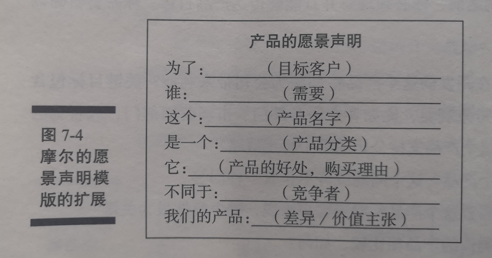

# 第7章 定义产品愿景和产品路线图

* 敏捷项目需要为整个项目制定计划，还要为每次发布、冲刺和每天的工作制定计划
* 做好计划是敏捷项目成功的基础
* 计划工作贯穿整个项目的始终
* 在活动开始前的最后时刻做计划，叫做“准时制计划”或“情景了解策略”

## 敏捷项目中的计划

* **阶段一：PO[^1] 确定`产品愿景`(Product Vision)**
  * 项目的目标
  * 每年重新审视一次
  * 定义：
    * 产品是什么，
    * 如何支持公司/组织战略，
    * 谁会使用这个产品，
    * 为什么人们要使用这个产品
* **阶段二：PO[^1] 创建`产品路线图`(Product Roadmap)**
  * 产品需求的总体描述
  * 每半年修改一次
  * 通过识别产品需求，划分优先级和粗略估算所需工作量，确定需求的核心内容和识别需求差异
* **阶段三：PO 创建`发布计划`(Release Plan)**
  * 明确了可工作软件的发布时间表
  * 版本发布是可以让Scrum 团队行动起来的中期目标
  * 应该在每个发布的启动阶段就做好发布
* **阶段四：PO[^1]、SM[^2]、DT[^3] 一起为冲刺(迭代)做计划，然后着手在每个冲刺中实现这些产品功能**
  * 在每个冲刺的开始阶段召开冲刺计划会议
  * 确定冲刺目标
  * 列出能够在冲刺中完成的并且支持项目总体目标的需求
  * 大致结束如何完成这些需求
* **阶段五：在每个冲刺过程中，DT[^3] 通过`每日例会`(Daily Scrum Meeting) 来协商当天工作的重点**
  * 昨天完成了哪些任务
  * 今天准备要完成哪些任务
  * 各自遇到了什么障碍
* **阶段六：Scrum 团队进行 `冲刺评审`(Sprint Review)**
  * 每个冲刺结束时的评审会议中，向产品干系人演示可工作的产品
* **阶段七：Scrum 团队进行 `冲刺回顾`(Sprint Retrospective)**
  * 在每个冲刺结束时进行
  * 讨论这个冲刺的表现
  * 为下一个冲刺做好改进计划

### 只做必要的计划
* 研究表明，一项应用程序中有64%的特性很少或者基本不会被用户使用。在敏捷项目的前几个开发周期中，你将优先完成哪些客户会使用的、高优先级的特性

### 检查与调整
* 在项目的每个极端，都需要察看产品和流程(检查)，然后根据需要做出变更(调整)
* 敏捷方法支持在需要的时候所制定的详细计划，可以立刻根据计划开发定义的具体需求
* 注意！
  * PO[^1] 在冲刺时提供反馈，帮助 DT[^3] 改进正在开发中的产品
  * 干系人在每个冲刺结束后的评审中为产品未来的改进提出反馈意见
  * Scrum 团队在每个冲刺结束后的回顾中，讨论本次冲刺中积累的经验教训，并改进开发流程
  * 新产品发布后，可根据正在使用这些产品的用户的反馈来进行产品改进

## 定义产品愿景
* 敏捷项目的第一个阶段是定义项目的愿景
* `产品愿景声明`(Product Vision Statement)
  * 用来表述产品是如何支持公司或组织战略的电梯游说或快速总结
  * 愿景声明必须清楚地说明产品的目标
* 愿景声明 本身需要聚焦、清晰、非技术性、尽量简明扼要、明确。
* 四个步骤
  * 设定产品目标
  * 创建愿景声明的草案
  * 与产品和项目干系人确认愿景声明，并根据反馈进行修改
  * 最终确定愿景声明

### 设定产品目标
> 在编写愿景声明之前，必须理解并能够传达`产品目标`，需要**明确**：

* `产品关键目标`
  * 开发中的产品将如何给公司带来利益？
  * 这个产品支持公司的哪个特定战略？
* `客户`
  * 谁会使用这个产品？
* `需求`
  * 客户为什么需要这个产品？
  * 对于客户来说，哪个特性最为关键？
* `竞争`
  * 这个产品和类似的产品相比较如何？
* `主要差异`
  * 与当前主流产品或竞争对手的产品相比，该产品有何差异？

### 创建愿景声明的草案
* 《跨越鸿沟》为定义产品总体愿景提供了一个很好的指导
* `投资回报率`(ROI)：是指公司从支出中获得的收益
  * 可以是`定量的`(实在的收益)
  * 可以是`无形的`(口碑、满意度)
* 通过创建愿景声明来`传递产品质量`、`维护需求和耐用性`相关的东西
* 摩尔愿景声明(见图)

### 与产品和项目干系人确认愿景声明，并根据反馈进行修改
* 审核条件
  * 是否清晰、切中要点、面向内部听众？
  * 是否有力说明了产品是如何满足客户需求？
  * 是否描述了最理想情况下的成果？
  * 业务目标是否足够具体且可以实现？
  * 所传递的价值是否和企业的战略及目标相一致？
  * 是否令人信服？
* 与相关角色一起审核
  * 项目干系人：能够确认声明
  * 你的开发团队：必须理解产品需要实现什么
  * SM ：有助于排除障碍
  * 敏捷导师：能够提供客观的观点

### 最终确定愿景声明
* 确保相关角色拿到了最终版本

## 创建产品路线图

[^1]:产品负责人(ProductOwner)
[^2]:敏捷主管(ScrumMaster)
[^3]:开发团队(DevTeam)