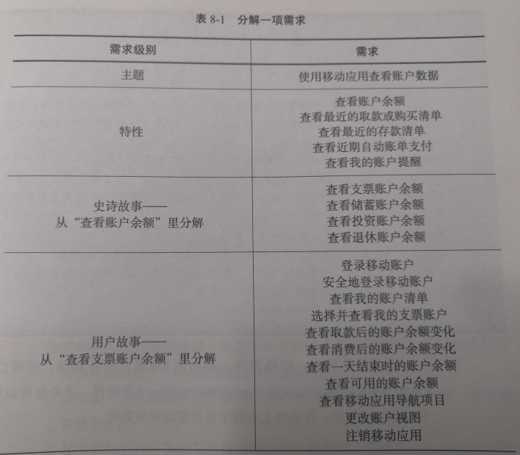

[TOC]
# 第8章 计划发布与冲刺

## 细化需求和估算
### 什么是用户故事
#### 概念
* 是一种清晰、有效地定义产品需求的形式
* 是一种对某个产品需求的简单描述，具体来说就是需求是什么、为谁完成
#### 内容
* **※** `标题`：<用户故事的名称>
* **※** `作为`<用户 或 角色>
* **※** `我想`<采取这样的行动>
* **※** `以便`<我获得这样的好处>
* ✔ `当我`<采取行动>时，将产生<这一行为的描述>
* ☛ **用户故事编码**。
  * 可以区分不同用户故事的编码
  * AC1、AC2....
* ☛ **用户故事价值和工作量估算**。
  * _价值_：在创建产品时，一个用户故事会给组织带来那些好处
  * _工作量_：创建这个用户故事的难易程度
* ☛ **提出该用户故事的人员名字**：
  * 项目团队中的任何成员都能创建用户故事

---

* PO 负责收集和管理用户故事，开发团队和感谢人也会参与和分解用户故事
* 用户故事不是描述产品需求的唯一方式，但是一种非常有效的方式，可以精准地传达产品需求到底是什么
* 开发团队会明确地知道他们为谁去创建产品需求，需求应该做什么，以及怎么仔细检查需求到底是什么

### 创建用户故事的步骤
#### 1.识别项目干系人
* 定期与客户互动的人
* 与产品的客户互动的不用领域的业务专家
* 产品的用户
* 正在创建的产品类型的专家
* 技术型干系人

#### 2.识别谁将使用该产品(识别客户)
* 任务角色背景：名字、年龄、性别、职业、爱好、厌恶的事物和需求
* 特定人群中的人或某种类型的用户

#### 3.确定产品需求和创建用户故事(和干系人协作,写下产品将需要达成的需求,并用一定格式去创建用户故事)
* 召集干系人共同参与与创建用户故事
* 确保将新的用户故事持续增加到产品待办列表
* 时刻保持更新产品待办列表，有助于得到优先级最高的用户故事

### 分解需求
#### 需求多次细化的过程
* 创建产品路线图时，创建出了特性以及主题
  * 特性：开发新特性后，客户将拥有的能力
  * 主题：特性的逻辑组合
  * Platinum Edge 要求特性不能超过 144 个故事点
* 计划发布时，将这些特征分解为更简明的用户故事
  * 计划发布级别的用户故事可以是史诗级别的(包含多个行动的大型的用户故事)，或者是包含单一行动的单个用户故事
  * 对客户而言，计划发布级别的用户故事不应超过 34 个故事点
* 计划冲刺时，可以更进一步分解用户故事
  * 也可以确定冲刺阶段与每个用户故事相关联的个人任务
  * 对客户而言，计划冲刺级别的用户故事不应超过 8 个故事点

---
* 一个故事点就代表每项需求的价值和工作量的相关分数

### 估算扑克(Estimation Poker)

* 也称为`计划扑克`(Planning Poker)
* 能够确定用户故事的大小
* 开发团队必须努力创造这些故事所描述的特性
  * SM 能帮助协调估算工作
  * PO 能提供特性的相关信息
  * 开发团队 负责估算用户故事所需要的工作量级别
* 用户故事分解的程度
  * `独立的` ：一则故事所描述的特征不依赖其他故事
  * `可协商的`：不需要太过详尽，为细节流出讨论和补充的余地
  * `有价值的`：故事是为了给客户展现产品价值
  * `可估算的`：故事是描述性的、准确的、简练的，便于开发者能大体估算工作量
  * `小型的`：计算和精确估算较小的用户故事会更加轻松。一个用户故事占用开发团队一名成员的时间，不应超过冲刺阶段时长的一半
  * `可测试的`：可以轻松证明用户故事，并且能得到明确的结果

### 相似估算
* 对以下每一类别共同确定一则单一的用户故事，每一类所花时间不超过 1 min

|大小|分数|
|---|---|
|非常小型(XS)  |1`|
|小型(S)   |  2`|
|中等(M)   |  3`|
|大型(L)   |   5`|
|非常大型(XL) | 8`|
|过大而无法纳入冲刺的史诗故事||

* 将多有剩下的步骤归入步骤一中列出的类别里，每个用户故事所花时间不超过 30s
* 评审并调整用户故事的位置，每 100 个用户故事最多花 60 min 时间
  * 整个开发团队必须对用户故事的大小分类达成共识
* PO 对用户故事的分类进行评审
* 当团队的实际估算值与 PO 的期望估算值相差超过了一个尺寸时，他们会讨论这则用户故事
  * 开发团队会决定是否调整这则用户故事的大小
  * PO 和开发团队完成待定项讨论后，开发团队对用户故事的大小有最终决定权

## 发布计划
* 发布 指发布出来用于生产的一组可用的产品特性
  * 不需要包含所在路线图中列出的功能，但至少要包含最小可上市的特性集(Minimal Marketable Features)
* 发布计划包括两项关键活动
  * **修订产品待办列表**
  * **发布计划**
* 产品待办列表以及发布计划是 PO 与团队之间最重要的沟通渠道

### 完成产品待办列表
* 产品路线图：
  * 包含了`主题`、`史诗故事`、一些暂定的`发布时间表`
* 产品待办列表**是与项目相关的所有用户故事的列表**
  * PO 通过不断`添加用户故事`和`为用户故事排定优先级`来**创建和维护**产品待办列表
  * Scrum团队 会在**发布计划阶段**和**整个项目**中使用该待办列表
* 创建产品待办列表，要确保
  * **包含对需求的描述**
  * **按优先级对用户故事进行排序**
  * **添加工作量估算**
* Scrum团队 视产品待办列表为项目需求的`主要来源`
  * 如果出现了一项需求，它就会体现在产品待办列表中
  * 产品待办列表的用户故事会在整个项目中**以多种方式发生变化**
    * 完成了用户故事后，会在产品待办列表中标记为完成状态
    * 也会记录新的用户故事
    * 根据需要不断更新现有用户故事的优先级和工作量分数
* 产品待办列表里的故事分数之和——所有用户故事的分数加在一起——就是当前的产品待办列表估算(Product Backlog Estimate)
  * 每天这个估算值都随着用户故事的完成和新的用户故事的加入而改变
* 保持产品待办列表实时更新，以便精确掌控成本和估算进度
* 现有的产品待办列表会帮助灵活地排定新的产品特性与现有的产品特性的优先级

### 创建发布计划
* 发布计划包含特定的一套特性的发布时间表
* PO 在每次发布开始时创建发布计划

#### 步骤
* 1.建立发布目标
  * 发布目标是发布中的产品特性的总体业务目标
  * PO 和 开发团队 根据业务优先级、开发团队的开发速度、开发团队的能力而创建发布目标
* 2.通过评审产品待办列表和产品路线图，来确定哪一个是支持发布目标的最高优先级的用户故事
  * 这些用户故事组成第一次发布内容
  * 推荐80%的用户故事去完成发布，20%去提升实现发布目标的稳定性
* 3.指定发布日期
* 4.如果还没有准备充分，优化发布目标里的用户故事
* 5.让开发团队接受首次发布并对这次发布许下承诺
  * 确保开发团队接受首次发布并对这次发布许下承诺

---

* 钢笔-铅笔法则
  * 可以确定(用钢笔写)首次发布的计划，但是首次发布以外的任何事都是暂定的(用铅笔写)

## 冲刺计划
* 每次冲刺包括下列事项
  * 在冲刺开始时进行的冲刺计划
  * 每日例会
  * 开发时间——冲刺的主体
  * 冲刺结束时进行冲刺评审和冲刺回顾

### 冲刺待办列表
* 与当前冲刺和相关任务关联的用户故事清单

---

* 计划冲刺时
  * 为冲刺设立目标
  * 选择支持这些目标的用户故事
  * 将用户故事分解为具体的开发任务
  * 创建一个冲刺待办列表。包括
    * 冲刺内按优先级排序的用户故事清单
    * 每个用户故事的相对工作量的估算
    * 开发每个用户故事的必要任务
    * 完成每个任务的工作量(以小时计算)
    * 燃尽图,用于显示开发团队已完成的工作状况
* 开发团队需要通力协作去创建和维护冲刺待办列表，且只有开发团队可以修改冲刺待办列表
* 冲刺待办列表反映冲刺进展的最新状况

### 冲刺计划会议
* 开发团队会在每次冲刺的第一天(通常是周一早上)召开冲刺计划会议
* 确保参会的每个人在整个会议过程中都能够全身心地投入
* 冲刺计划会议的时长是建立在冲刺时长的基础上的
* 每周的冲刺计划会议不应超过2个小时
* 可以把冲刺计划会议分为两个部分
  * 一部分用来设定冲刺目标以及为冲刺选择用户故事
  * 一部分将用户故事分解为单独的任务
