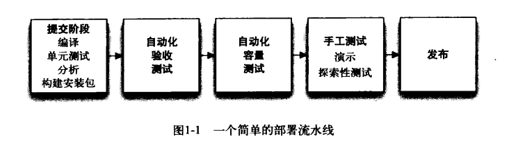

[TOC]

# 第1章.软件交付的问题.md

## 1.1 引言
* 中心模式是部署流水线。从本质上讲，部署流水线就是指一个应用程序从构建、部署、测试到发布这整个过程的自动化实现

## 1.2 一些常见的发布反模式
### 1.2.1 反模式：手工部署软件
* 症状特征
    * 有一份非常详尽的文档，该文档描述了执行步骤及每个步骤中易出错的地方。
    * 以手工测试来确认该应用程序是否运行正确。
    * 在发布当天开发团队频繁地接到电话，客户要求解释部署为何会出错。
    * 在发布时，常常会修正一些在发布过程中发现的问题。
    * 如果是集群环境部署，常常发现在集群中各环境的配置都不相同，比如应用服务器的连接池设置不同或文件系统有不同的目录结构等。
    * 发布过程需要较长的时间（超过几分钟）。
    * 发布结果不可预测，常常不得不回滚或遇到不可预见的问题。
    * 发布之后凌展两点还睡眼惺恢地坐在显示器前，绞尽脑汁想着怎么让刚刚部署的应用程序能够正常工作。
* 对策
    * 部署应该走向完全自动化，即对于那些负责将应用程序部署到开发环境、测试环境或生产环境的人来说，应该只需要做两件事：
        * （1）挑选版本及需要部署的环境
        * （2）按一下“部署”按钮。
        * 对于套装软件的发布来说，还应该 有一个创建安装程序的自动化过程

### 1.2.2 反模式：开发完成之后才向类生产环境部署
* 症状特征
    * 如果测试人员一直参与了在此之前的过程，那么他们已在开发机器上对软件进 行了测试。
    * 只有在向试运行环境部署时，运维人员才第一次接触到这个新应用程序。在某些组织中，通常是由独立的运维团队负责将应用程序部署到试运行环境和生产环境。在这种工作方式下，运维人员只有在产品被发布到生产环境时才第一次见到这个软件。
    * 有可能由于类生产环境非常昂貴，所以权限控制严格，操作人员自己无权对该环境进行操作，也有可能环境没有按时准备好，甚至也可能根本没人去准备环境。
    * 开发团队将正确的安装程序、配置文件、数据库迁移脚本和部署文档一同交给那些真正执行部署任务的人员，而所有这些都没有在类生产环境或试运行环境中进行过测试。
    * 开发团队和真正执行部署任务的人员之间的协作非常少。

* 对策
    * 将`测试、部署和发布活动`也纳入到`开发过程`中，让它们成为开发流程正常的一部分

### 1.2.3 反模式：生产环境的手工配置管理
* 症状特征
    * 多次部署到试运行环境都非常成功，但当部署到生产环境时就失败。
    * 集群中各节点的行为有所不同。例如，与其他节点相比，某个节点所承担的负载少一些，或者处理请求的时间花得多一些。
    * 运维团队需要较长时间为每次发布准备环境。
    * 系统无法回滚到之前部署的某个配置，这些配置包括操作系统、应用服务器、关系型数据库管理系统、Web服务器或其他基础设施设置。
    * 不知道从什么时候起，集群中的某些服务器所用的操作系统、第三方基础设施、依赖库的版本或补丁级别就不同了。
    * 直接修改生产环境上的配置来改变系统配置。
* 对策
    * 配置管理
        * 能够`重复地创建`那些开发的应用程序所依赖的每个基础设施
        * 应该具有`重建生产环境`的能力，最好是能通过`自动化`的方式重建生产环境
    * 应该完全掌握生产环境中的任何信息
        * 生产环境中的`每次变更都应该被记录`下来，而且做到今后可以`査阅`
        * `不应该允许手工改变`测试环境、试运行环境和生产环境，而`只允许通过自动化过程来改变`这些环境

## 1.3如何实现目标
* **`速度`是至关重要**
    * 减少周期时间（cycletime）
    * 周期时间是从决定进行变更的时刻开始，包括修正缺陷或增加特性，直至用户可以使用本次变更后的结果
* **`快速交付`也是非常重要的**
    * 这使你能够验证那些新开发的特性或者修复的缺陷是否真的有用
* **有用性的一个重要部分是`质量`**
    * 交付质量足够高的软件，给客户带来价值
* **为了达到这些目标（短周期、高质量），我们需要`频繁且自动化地发布软件`**
    * **自动化**
        * 如果构建、部署、测试和发布流程不是自动化的，那它就是不可重复的
        * 常常说软件发布像是一种艺术，但事实上，它应该是一种工程学科
    * **频繁做**
        * 如果能够做到频繁发布，每个发布版本之间的差异会很小
        * 会大大`减少`与发布相关的`风险`，且更`容易回滚`
        * 频繁发布也会`加快反馈速度`，而`客户也需要`它
        * `反馈`的三个标准
            * 无论什么样的修改都应该触发反馈流程
            * 反馈应该尽快发出
            * 交付团队必须接收反馈，并依据它作出相应的行动

### 1.3.1 每次修改都应该触发反馈流程
* 一个可工作的软件
    * 可执行的代码
    * 配置信息
    * 运行环境 
    * 数据
* 持续集成
    * 构建可执行代码并对其进行测试都应该是自动化的。
    * 每次提交都对应用程序进行构建并测试
    * 之后的部署活动中都应该使用这个构建并测试后的可执行代码，无论是部署至測试环境，还是生产环境
* 对环境的任何修改都应该作为配置信息来管理
    * 无论在什么环境下，对于应用程 序配置的变更都应该被测试
* 反馈流程
    * 概念：指完全以自动化方式尽可能地测试每一次变更
    * 测试：
        * `创建可执行代码的流程必须是能奏效的`
            * 这用于验证源代码是否符合语法
        * 软件的`单元测试必须是成功的`
            * 这可以检査应用程序的行为是否与期望相同
        * 软件应该`满足一定的质量标准`
            * 比如测试覆盖率以及其他与技术相关的度量项
        * 软件的`功能验收测试必须是成功的`。
            * 这可以检査应用是否满足业务验收条件，交付了所期望的业务价值
        * 软件的`非功能测试必须是成功的`。
            * 这可以检査应用程序是否满足用户对性能、有效性、安全性等方面的要求
        * 软件必须通过了`探索性测试`，并给客户以及部分用户`做过演示`
            * 通常在一个手工测试环境上完成
            * 写自动化测试来避免回归测试

### 1.3.2 必须尽快接收反馈
* 快速反馈的关键是自动化
* 我们应该集中人力来生产用户所需要的新功能，尽可能快速地交付这些新功能，而不是做枯燥且易出错的工作
* 实现这样的部署流水线是需要大量资源的
* 对于整个流水线中的提交（commit）阶段，其测试应具有如下特征
    * 运行速度快
    * 尽可能全面，即75%左右的代码库覆盖率
    * 如果有测试失败的话，就表明应用程序有严重问题，无论如何都不能发布
    * 尽可能做到环境中立
    * 它们通常运行更慢一些，所以适合于并行执行
    * 即使某些测试有可能失败，但在某种场合下，我们还是会发布应用程序
        * 个即将发布的版本有一个不稳定的修复，会导致其性能低于预先定义的标准
    * 它们的运行环境应该尽可能与生产环境相同
* 基础之一就是快速的反馈
    * 注意开发软件的流程
    * 如何使用版本控制系统和如何组织代码
    * 开发人员应该频 繁提交代码到版本控制系统中
    * 大多数情况下，应该避免使用分支(増量式交付)

### 1.3.3 交付团队必须接收反馈并作出反应
* 参与软件交付过程的`所有人`（包括开发人员、测试人员和运维人员、数据库管理员、 基础设施的专家以及管理者）都应该`参与`到这个`反馈流程`中，这是`至关重要`的
* 对于快速交付高质量的软件来说，基于`持续改进`的过程是非常关键的
* 迭代过程
    * 有助于为这类活动建立规律性
    * 每个迭代至少开一次回顾会议
* 想要能够`根据反馈来调整行动`，就要对`信息`进行`广播`
    * 使用一个大且可视的仪表盘
    * 其他通知机制对于确保反馈送达到每一个人

### 1.3.4 这个流程可以推广吗
* 精益制造的目标是确保 快速地交付高质量的产品，它聚焦于消除浪费，减少成本
* 这一理论与实践既可以应用在大型组织中，也可以应用于小团队

## 1.4 收效

### 1.4.1 授权团队

* 测试人员可以选择性地部署较旧的版本，以验证新版本上的功能变化
* 技术支持人员可以自己部署某个已发布的版本，用于重现缺陷
* 作为灾难恢复手段，运维人员可以自己选一个已知的正确版本，将其部署到生产环境中
* 发布方式也变成一键式

---

* 团队成员可以更好地控制工作节奏，从而改进工作质量，这就会让应用程序的质量得以提高
* 团队成员协作更加有效，无用的交互更少，可以更高效地工作

### 1.4.2 减少错误
* 出错
    * 最初委托制作这个软件的人就可能出错
    * 需求分析人员可能将需求理解错
    * 开发人员也可能写出了到处都是缺陷的程序
    * **由不良好的配置管理引入到生产环境的错误**
* 避免
    * 通过积极地管理在版本控制库中的所有可能变动的内容
    * 让计算机来做它们擅长的所有事情
    * 消除“中间人” ：让计算机直接使用这些配置信息，而不是再通过手工输入的方式来进行软件配置

### 1.4.3 缓解压力
* 压力
    * 一些敏感、保守且具有质量意识的项目经理常常对开发人员说：“都这个时候了，你就不能直接修改一下代码吗？”
    * 让数据库管理员把他们并不清楚来路的数据录入到应用程序的数据库表中
* 缓解
    * 自动化部署过程，并频繁地运行它，当部署失败后还能够快速恢复到原来状态

### 1.4.4 部署的灵活性
* 在一个全新环境上运行应用程序应该是相当简单的事。
* 理想情况下，只要安装机 器或虚拟镜像，然后配置一些与具体运行环境相关的特定选项。然后，你就可以使用自动化过程准备好新的部署环境，并选择指定的应用程序版本进行部署

### 1.4.5 多加练习，使其完美
* 最好的策略就是无论部署到什么样的目标环境，都使用相同的部署方法
* 只有一种环境可以有多变性，那就是开发环境

## 1.5 候选发布版本
* 尽管每次修改都可以产生一个能够交给用户的最终产物，但是我们应该首先对每次修改都进行适用性评估。只有这次修改没有缺陷，而且满足由客户定制的验收条件，才能够发布它

### 每次提交代码都可能产生一个可发布的版本
* 集成频率越低，集成时我们就 会越痛苦
* 应该频繁做集成，事实上应该在每次提交修改后都做集成 
* 持续集成会及时检测到任何一次破坏已有系统或者不满足客户验收测试的提交

## 1.6 软件交付的原则

### 1.6.1 为软件的发布创建一个可重复且可靠的过程
* 可重复性和可靠性来自于以下两个原则
    * 几乎将所有事情自动化
    * 将构建、部署、测试和发 布软件所需的东西全部纳入到版本控制管理之中
* 软件部署总结
    * 提供并管理你的软件所需要的运行环境，这包括硬件配置、所依赖的软件、基础设施以及所需的外部服务
    * 将你的应用程序的正确版本安装在其之上
    * 配置你的应用程序，包括它所需要的任何数据以及状态

### 1.6.2 将几乎所有事情自动化
* 有些工作是不可能被自动化
    * 探索性测试就依赖于有经验的测试人员
    * 向用户代表们演示程序
    * 人工的审批流程
* 自动化是部署流水线的前提条件
    * 不需要把所有的东西一次性地全部自动化
    * 看一下在构建、部署、测试和发布过程中，哪个环节是瓶颈

### 1.6.3 把所有的东西都纳入版本控制
* 将构建、部署、测试和发布的整个过程中所需的东西全部保存在某种形式的版本存储库中
    * 需求文档、测试脚本、自动化测试用例、网络配置脚本、部署脚本、数据库创建、升级、回滚和初始化脚本、应用程序所依赖的软件集合的配置脚本、库文件、工具链以及技术文档
    * 这些内容都应该受到版本控制，与每次构建结果相关的版本都应可以识别
    * 变更集(change set)都应该有唯一标识， 比如构建号、版本控制库中的版本号
    * 应该也能够方便地知道当前每个环境中到底部署了应用程序的哪个版本，及其在版本库中所对应的版本号

### 1.6.4 提前并频繁地做让你感到痛苦的事
* 这是最通用的原则，也是最有启发性的
* 极限编程：启发式原则
    * 可能需要选择 一个中期目标，比如每隔几周做一次内部发布
    * 逐步地走向理想状态，即使是一小步一小步地进行，也会带来很大的价值

### 1.6.5 内建质量
* 内建质量 和 持续改进 都是从精益运动（leanmovement）中借鉴来的
* 在没有提交代码到版本控制之前，我们就能发现并修复缺陷的话，代价是最小的
* 两个推论
    * **测试不是一个阶段**，当然也不应该开发结束之后才开始
    * **测试也不纯粹或主要是测试人员的领域。交付团队的每个人都应该对应用程序的质最负责**

### 1.6.6 “DONE”意味着“已发布”
* 一个特性只有交到用户手中才能算“DONE”
* 对于一些敏捷交付团队来说，“DONE”意味着软件已经部署到生产环境上
* 根本没有“已经完成了80%”这一说法。任何事情要么是完成了，要么就是没完成。

### 1.6.7 交付过程是每个成员的责任
* 理想情况下
    * 团队中的成员应该有共同的目标，并且每个成员应在工作中互相帮 助来实现这一目标。无论成功还是失败，其结果都属于这个团队，而非个人
* 现实
    * 开发者开发后将困难转交给测试者，而测试者又在发布时将困难转嫁到运维团队
    * 人们花费大量的时间来修复错误，并用同等的时间 来互相指责
* DevOps运动的焦点
    * 为了更加快速且可靠地交付有价值的软件，鼓励所有参与软件交付整个过程中的人进行更好的协作

### 1.6.8 持续改进
* 应用程序的首次发布只是其生命周期中的第一个阶段
* 交付过程应该不断演进
* 在交付过程中，整个团队应该定期地坐在一起，召开回顾会议，反思一下在过去一段时间里哪些方面做得比较好，应该继续保持，哪些方面做得不太好，需要改进， 并讨论一下如何改进
* 每个改进点都应该有一个人负责跟踪，确保相应的改进活动能够被执行
* 关键在于组织中的每个人都要参与到这个过程当中

## 1.7 小结
* 益处
    * 能够验证变化, 重现各种环境中的部署过程，在很大程度上减少产品出错的机会
    * 由于发布过程本身 已不再是一个障碍，我们可以部署软件变更，从而更快地获得商业利益
    * 实施自动化系 统会促使我们将好的实践付诸行动
        * 行为驱动的开发
        * 综合的配置管理
    * 自动化的开发、测试以及发布过程对发布软件的速度、质量和成本有着深远的影响