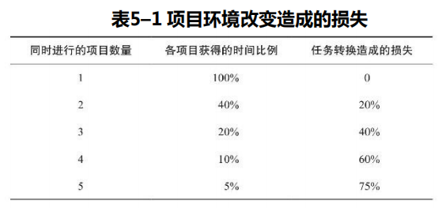
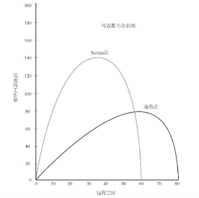

> Scrum流程的核心是节奏，这种节奏对人类很重要。
> 
> 特别是在企业环境中，我们面临着自我存在感严重缺失的问题。这似乎是由命运决定的。
> 
> Scrum要做的就是创建一种与此不同的模式。
> 
> 我们是受习惯驱策的动物，探寻在一定程度上可以预测节奏，但是我们也具有一些神奇的能力，能够达到卓越境界。

# 丰田汽车公司的大野耐一，

## 他说过：“浪费不只是一种商业损失，更是对社会的一种犯罪。”
## 谈到浪费有三种类型
### 无理 （Muri）
* 超载的设备或是超负荷的工人，通 常是工作的节奏比原设计更快、要求更高所致。

### 无稳（Mura）
* 指生产运作的不平衡。
* 如：
  * 生产系统的进度安排不符合客户的需求，而是由生产系统本身决定的
  * 不均衡的工作节奏导致 操作员有时匆忙，有时空闲。

### 无驮（Muda）
* 指一切不为顾客创造价值但却消耗资源的活动。

# 戴明的PDCA循环
## `计划`意味着避免活动安 排不合理
## `执行`意味着避免与计划内容不一致
## `检查`意味着避免浪费
## `行动`意味着意志、动机、 决心的统一与实践

# 一、一次只做一件事
> 人们吹嘘自己一心多用的能力，我们都想成为那样的人，也暗示自己可以做到。
> 
> 然而，不幸的是，我们不能。事实上，我们越是认为自己能做得到，我们就做得越糟糕。

## 戴维·三本松（David Sanbonmatsu）

> 人们对于自己同时执行多项任务的能力 往往存在严重自信心膨胀的看法；
> 事实上，大部分受试者都判断自己在这方面的能力属于中等偏上。
> 这种自我评估是没有事实依据的。
> 因此，那些经常同时执行几项任务的人以及在开车时打电话的人很有可能高估了自己的能力。

## “双重任务冲突”（Dual Task Interference）
* 一旦增加别的任务，不 管新增的任务多么简单，需要的时间都会加倍

## 帕施勒推理
* 人类大脑的信息处理能力存在某种瓶颈，人们真的每次只能思考一件事情。
* 在不同任务间转换的时候，你肯定会花费一定的脑力去“结束”上一个任务，然后从记忆里把另一个任务拉出来，然后你才能开展新的任务。
* 每次转换任务，这个过程就需要花费一定的时间。

## 伦敦大学精神病学家格伦·威尔逊（Glenn Wilson）在2005年做了一项`衡量同时执行多项任务能让你变得多么愚蠢`的研究
* 找来4名男性和4名女性，分别在安静的 环境和易于分心的环境（电话响起、收到电子邮 件）测试他们的智商。
* 结果：
  * 在容易分心的环境中，他们的平均智商得分下降了超过10个百分点
  * 更加有趣的是，男性智商比女性智商下降得更快。（或许，由于某种原因，女性更习惯于分心。）

> 我希望大家能够意识到环境改变是有成本的,应该努力实现 这种成本的最小化。
>
> 同时执行多项任务不仅浪费时间，还会使人变得麻木愚蠢

# 二、半途而废等于丝毫没做

## “在制品”（work in process），有时候也被称为“存货”。
* 一堆材料堆在那里而不用来制造东西是一种浪费。

## Scrum开发过程中的工 作是有节奏的。
* 每一个迭代期，或者说每一个冲刺期，团队都试图完成很多事情。
* 但是“完成”意味着一款能被消费者使用的、完整的、可交付的产品。
* 如果在迭代期的最后，事情只做了一半，你将比一点都没开始做更糟糕。你花费了资源，付出了努力和时间，最后没有得到任何成果。

## `实体存货`是审视“在制品”或者说“存货”的另一个角度。
* 是库存太多 了，占用了大量有价值的资源
* 如果大批存货的价值无法实现，那么你就没有足够的资源去做别的事情
* 你必须维持一定数量的库存，但关键是尽可能地让库存规模最小化。

## 没有做完的工作和无人使用的产品是一件事情的两个方面，本质上是一样的：你付出了努力，最后却没有收获积极成果。不要这样做。

# 三、一次性地把事情做好
* 我们不可能每次都一次性地把事情做完美,但处理错误的方式会给你做事的速度和效率带来很大的影响

## 处理问题的最佳时机是你发现问题的时候，而不是发现问题之后很久再着手解决

## 软件测试
* 做法1.发现故障后立即加以修复
* 做法2.发现故障几个星期之后再加以修复

### 这两个时间点解决故障所需的时间，后者是前者的24倍。

# 四、工时越长，效率越低

## OpenView公司前期文化
* 是期待员工延长工时，并在周末加班
* 该公司的成员都很有闯劲和雄心，但是他们逐渐变得精疲力竭，沮丧忧郁，士气低落。
* 由于公司的环境压力太大，一些无法接受的员工便选择了辞职。

## OpenView公司采用Scrum方法
* OpenView风投公司的创始人斯科特·马克斯韦尔（Scott Maxwell） : 加班加点地工作 不是敬业的标志，而是失败的标志
* 他让员工早点下班，不是想让他们过一种平衡的生活，而是因为他们会完成更多的工作
* 该公司的思维方式认为，如果一个团队的领导者在休假时还要确保办公室一切正常，那么这就说明他没有管理好自己的团队。

### 斯科特·马克斯韦尔（Scott Maxwell）
* 缩短工时可以让你以更高的质量完成更多工作
* 每个人工作效率变化的曲线都不尽相同。就算是同一个人，在生命中的不 同时刻，曲线也会有所不同。
* **工作时间太长的人会开始犯错**，改正错误可能会比创造新成绩花费更多的时间
* 工作超出负荷的员工比较不容易集中注意力，而且会影响别人也跟着分心，不久之后他们就会开始做出错误决策。

### 我们做决策的能力很有限，我们的精力消耗得越多，休息时间越短，我们做出的决策就会越糟糕。

### “自我损耗”（ego depletion）
* 做出任何选择都需要耗费一定的精力
* 这是一种奇怪的损耗，因为你感觉不到身体的疲惫，但做出良好决定的能力会下降
* 你的自我控制能力、自我约束能力、思考能 力以及预见能力等都会趋于减弱。

### 结论
* 你每天能做的明智决定是有限的，做出的决定越多，就越会耗损自我控制能力，然后你就会开始一路犯错，最后犯下严重错误。
* 这些不良决定将会影响到工作效率。

### Scrum方法要求参与者摒弃那种只衡量工时的思维，因为工时只代表着一种成本。
### 只要关注完成任务的速度和质量就足够了，这才是唯一重要的事情。

# 五、确保工作的合理性

### 大野耐一指出三种浪费会延长人们的工作时间，加重工作负担

### 第一种：“目标荒谬”。
* 可以给你的团队制定一些富有挑战性的目标，促使他们创造更多成果，
* 但不能制定一些荒谬的、不切实际的目标

### 第二种：“期待过高”。
* 如果一个团队经常依赖某个“英雄人物”才能赶在截止日期之前完成任务，就说明这个团队平时并没有按照应有的方式开展工作
* 不停地从一个危机过渡到下一个危机会让人筋疲力 尽，团队也不可能实现合理、持续的改善

### 第三种：“负担过重”。
* 公司的规定过于烦琐，妨碍了工作；
* 没必要的汇报导致员工为了填表而填表；
* 没有意义的会议耗费了时间，却创造不出任何价值。

### 第四种：“情绪浪费”。（大野耐一没有提到，但的确存在）
* 在一个公司里面，只要存在一个令人讨厌的人，就会造成这种情绪浪费，因为这个人往往倾向于激怒别人，导致别人陷入狂躁。
* 这种人通常宣称自己只是在竭力帮助别人更好地工作，以此为自己的行为找到合理借口，其实它们只是在放纵自己性格中的一些消极方面
* 这种人最擅长削弱一个团队实现卓越业绩的能力。
* 不要做一个令人讨厌的人，而且也不要允许、纵容或容忍别人成为这种人。

# 六、确保工作的流畅性

## Scrum的作用就在于让我们集中精力消除那些在工作中看似很必要、实则无意义的浪费现象。
## 你在工作中真正想要的是不费力气的“流畅”状态。只是专心致志地发挥出人类自身的能力而已。
## 任何分散精力的事情都会造成浪费

# 小结
## 1. 同时执行多项任务会让你变愚蠢。
* 如果同时执行两项或更多任务，那么这些任务都会完成得更慢、更糟糕。
* 不要这么做。
* 如果你觉得自己是特例，那么你错了——这条规则肯定适用于你。

## 2. 半途而废等于没做。
* 一辆半成品的汽车只是消耗了原本可以用来创造价值或节约资金的资源而已。
* 任何在制品都是一样，只会消耗资金和能源，而不会产生任何有价值的成果。

## 3. 一次性把事情做好。
* 犯错的时候，要立即纠正。
* 停下其他所有事情，集中精力纠正错误。
* 如果留到以后再纠正，你就会多付出20多倍的时间。

## 4. 工时越长，效率越低。
* 工作太努力不会 让你做完更多的事，反而让你做得更少，让你疲惫不堪，从而导致失误，迫使你必须改进自己刚刚完成的工作。
* 不要工作到太晚， 周末也不要加班，要让自己的工作节奏具 可持续性。

## 5. 避免不合理现象。
* 富有挑战性的目标可以起到激励的作用，不可能实现的目标只会让人沮丧

## 6. 不要依赖“英雄”。
* 如果你需要一个“英雄”去完成工作，那就说明你的管理方式有问题。
* “英雄”应该被视为规划的失败。

## 7. 消除愚蠢的规定。
* 任何看似荒谬的规定都可能是愚蠢的。

## 8. 将令人生厌者踢出团队。
* 不要成为这类人，也不要纵容这类行为。
* 任何一个人，如果引起情绪混乱，让别人感到恐惧或害怕，贬低或蔑视他人，都应该被清理出团队。

## 9. 努力让工作流畅起来。
* 选择流畅性最强、麻烦最少的方式做事情。
