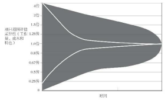

> 提前做规划这个做法太有诱惑力，太吸引人了，以至于很多人把计划放在第一位，把实际情况和行动方案抛至脑后。这是本末倒置的
> 
> 永远不要忘记：地图不是真实地貌。
> 
> 当一个团队第一次坐在一起勾勒一个项目时，往往会灵光忽现，似乎无限机遇就摆在眼前，觉得自己可以去发现新世界了，可以尝试新想法了。
> 
> 接下来，要从灵感过渡到评估阶段。这时，人们的激情可能会有所消退。
> 
> 不幸的是，如果你输入的是垃圾，那么输出的也一定是垃圾。
> 
> 参与者或许很聪明，但他们往往无法意识到自己在甘特图中描绘出来的内容只不过是一厢情愿的期待罢了
>

* 1.项目涉及的所有事项写到便笺纸上
* 2.须评估每张便笺纸上列出来的事项要做多少工作才能完成。（不是评估需要花费多少时间，而是评估需要做多少工作）
* 我们在项目进展过程中随时注重质量管控

# “完成的定义”（Definition of Done）。
* 让团队的所有成员都先把每件事做到符合质量标准，然后再去做下一件事，而非只是由监管人员来把关。

# 一、婚礼规划
## “不确定性圆锥”（cone of uncertainty）

## 在Scrum中，每个冲刺周期结束之际，都必须为顾客展示一些看得见、摸得着的新价值。
* 这是顾客要的吗？
* 这能帮顾客解决一些问题吗？
* 我们的方向是对的吗？

## 找出那些真正重要的事情和工作。

# 二、规模的确重要，但只是相对的
## 1.列出要做的事情并且排好优先顺序
## 2.确定这个项目需要花费多少精力、时间 和资金

## “斐波那契数列”（Fibonacci sequence），又称“黄金分割数列”。
* 每一个数字必须是前两个数字的和。比如， 0, 1, 1, 2, 3, 5, 8, 13, 21, 34, 55……
* Scrum团队喜欢使用斐波那契数 列来定义待办事项的难度。
* 我们的思维觉察不到平稳的增加，而是更擅长觉察从一个状态向另一个状态的跳跃，这种跳跃不是平稳的，而是较为猛烈的。
* 当我们借助斐波那契数列去评估一个任务的 难度时，不必追求绝对的准确
* 由于每个人都采用同样的评判尺度，我们能够征求他人对这项任务的难度的看法，有利于达成共识。

# 三、德尔菲的神谕

## 两种负面效应
### “信息瀑布”
* “如果一个人观察到之前众人的行为之后，认为最佳的做法是放弃自己掌握的信息，遵从之前众人的行为，那么这个时候信息瀑布就出现了。”

### “光环效应”，亦称“成见效应”或“日晕效应”，
* 指当认知者对一个人的某种特征形成好或坏的印象后，还倾向于据此推论该人其他方面的特征，本质上属于以偏概全的认知错误。

## 采取一些聪明的办法去削弱这种效应的影响 —— “德尔菲法”
* 《运用德尔菲法征求专家意见的实验》
* 专家评估
* 不希望专家们之间出现相互影响的情况——匿名调查
* 参加调查的专家中，没有一位知道其他人是谁，他们只负责提供自己的评估意见
* 做完一轮调查后，两位研究人员会拿着大家给出的答案以及用于得出答案的资料，消除任何足以判断身份的信息之后，再反馈给这群专家做参考，然后反复进行这样的流程

## “德尔菲法”的优点
* 可以广泛征求意见，尽量消除偏见，在匿名状态下将意见分歧缩小到可以接受的范围，最终得到明智的结论

## “德尔菲法”的缺点
* 是耗 费时间较多。

# 四、“计划扑克”（Planning Poker）
## 采取一些聪明的办法去削弱这种效应的影响 —— “计划扑克”
* 每个人都有一副牌，上面印着有趣的斐波那契数列数字，也就是 1、1、2、3、5、8、13等
* 每一个需要**`评估`**的事 项都会被列出来，摆到桌面上。
* 人们根据事项的难度，抽出一张相应的扑克牌放到桌子上，但正面朝下
* 听口令一起翻牌
* 如果数字之间相差的牌数不多于2张（比如一张5、两张8、一张13），只要把这几张牌的数字加起来，然后取一个平均值即可
* 继续探讨下一个事项

## 经验教训
* 只有真正 负责做事的团队才知道自己的项目要花费多少时 间和精力
* 团队都是独特的，应该具有独立性，每个团队都有自己的步调与节奏，强迫一个团队盲目遵从其他团队的安排，注定会招致灾难

# 不要盲目执行任务，要领会用户故事

> 很多时候，你只是被动地从别人那里接受任 务，却不知道为什么要这么做。
> 
> 员工的问题就在于没有得到足够的信息，而 上司的问题在于没有为下属提供足够的信息。
> 
> 人们习惯于用情节、故事去思考问题。大 家都是这样来理解世界的。
> 
> 我们比较容易掌握人 物、欲望及动机等，当我们试图把个别片段从主 线中剥离出来，脱离具体语境去理解它们时，就 会出现问题。
> 

## 一个好的用户故事包括三个要素
### 1.`角色`
* 谁要使用这个功能？
* 这项任务是为“谁”而做的？
* 打造这样东西、做这项决策、提交这项成果，我们应该从谁的角度出发？

### 2.`活动`
* 思考我们要完 成什么样的功能。
* 这通常是我们的出发点，也是落脚点。

### 3.`商业价值`，或者说动机
* 思考客户为什么需要这个功能，以及这个功能如何才能给客户创造价值。
* 这是`最重要的一步`。动机重于一切。

## 用户故事宜短不宜长
### 用户故事必须细化，能够对具体实践提供指导，但是 不要预先制订落实方案。
### 工作如何执行必须由团队自行决定，至于成果该是什么，则取决于`商业价值`。

## 用户故事必须完整，任务必须彻底完成
* 撰写用户故事或列出待办事项清单时
  * 用户故事够完整吗？
  * 如何才能知道自己已经完成了任务？

### 用户故事是否完整的标准 `INVEST标准` 【比尔·韦克（Bill Wake）】
#### 独立性（Independent）
* 尽可能让一个用户故事独立于其他的用户故事。
* 用户故事之间的依赖使得制订计划、确定优先级和工作量评估都变得很困难。
* 通常我们可以通 过组合用户故事和分解用户故事来减少依赖性。

#### 可协商性（Negotiable）
* —用户故事的内容要是可以协商的，用户故事不是合同。
* 一张用户故事卡片上只是一个简短的描述，不包括太多的细节。
* 具体的细节在沟通阶段提出。
* 如果一张用户故事卡片带有太多的细节，实际上会限制和用户的沟通。

#### 有价值（Valuable）
* 每个用户故事必须对客户具有价值。
* 一个让用户故事有价 值的好方法是让客户来写下它们。

#### 可评估（Estimable）
* 开发团队需要衡量用户故事，以便确定优先级和工作量，并便于安排工作计划。

#### 规模小（Small）
* 一个好的故事要尽 量维持小规模，至少要确保在一个冲刺周期中能够完成。
* 用户故事越大，在安排计划、工作量评估等方面的风险就会越大。

#### 可测试（Testable）
* 一个用户故事要可以测试，以便确定它是可以完成的。
* 如 果一个用户故事不能够测试，那么你就无法知道它什么时候可以完成。

> 每个有待落实的用户故事都应该要有“完整”的定义（比如是否符合INVEST标准），
> 
> 同样，最后的结果也要符合“完成的定义”（比如必须符合什么条件、通过什么测试才能结束等）。
> 

# 五、冲刺规划
> 在采用Scrum方法的过程中，每个冲刺阶段都要举行会议，规划本阶段的工作内容，
> 我们将这类会议称为“冲刺规划会议”（sprint planning meeting）。

* 个团队的所有成员审视一下必须落实的用户故事
  * 我们在这个冲刺阶段中能完成什么？
  * 这些故事完整吗？
  * 在冲刺结束时能完成吗？
  * 到时候能给顾客展示出真正的价值吗？

## 如何知道自己的速度
* 已经知道如何衡量团队实际上要做的事情,就可以开始回答事情“何时能够做完”的问题
* 可以获取全部用户故事，也就是那些需要做的事情，而且我们已经对它们进行过评估了
* 可以开始第一个冲刺了
* 在这个冲刺阶段结束之际，我们可以把所有已完成的故事列出来，把这些用户故事的难度评分加到一起，最终的数字就告诉我们团队的进度是多少，或者说速度是多少。
* 得知速度之后，可以看看手边还有多少用户故事没有完成，看看这些用户故事的难度相当于多少分，然后就知道什么时候可以完成了。
* 一旦掌握了自己的速度，你就可以着手解决 Scrum中最重要的事情：有没有什么因素妨碍速度更快呢？
* 从工作进度是否加快就能看出你是否真的消除了浪费现象。

# 小结
## 1.地图不是真实地貌。
* 不要爱上自己的规划。
* 几乎可以肯定地说，规划都存在错误之处。

## 2.仅仅规划你需要做的事情。
* 不要试图规划几年后的事情。
* 只要让自己的团队保持忙碌就足够了

## 3.待办事项的难度相当于多少“犬点”？
* 不要用时间之类的绝对尺度去做评估。事实表明，人类在这方面的能力很糟糕。
* 只要评 估相对难度就行了，看看一个待办事项相当 于多少“犬点”？（相当于哪个型号的T恤衫（小号、中号、大号、超大号、特大号）？）
* 或者采用更加常见的方法，用斐波那契数列 去做评估。

## 4.匿名征求意见。
* 运用德尔菲法等匿名方 法征求意见，以避免从众效应和光环效应， 防止人们相互参照，防止出现群体思维。

## 5.使用计划扑克。
* 使用计划扑克去快速评 估需要完成的工作。

## 6.学会写“用户故事”。
* 先思考一下哪些客户会从终端产品中得到价值，再思考一下究竟要为用户提供什么价值，以及用户为什么会需要这些价值。
* 人类习惯于按照叙事方式去组织自己的思维，因此，面对一个待办事项，要学会写用户故事，比如作为X，我想要Y，所以Z。

## 7.知道自己的速度。
* 每个团队都应该准确知道自己在每个冲刺阶段中完成了多少工作，并且应该知道如何以更加聪明的方法去消除障碍，加快工作速度。

## 8.速度×时间＝交付工作量。
* 知道自己的工作速度之后，就能计算出交付日期。

## 9.大胆制定目标。
* 运用Scrum方法，要让产 量翻一倍或者将交付时间缩短一半，并不是 什么难事。