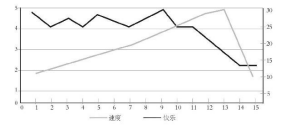
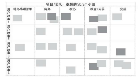

# 快乐便是成功

## 快乐的人往往表现更优秀
* 收入较高，工作较好，接受过大学教育，寿命也比较长
* 销售业绩比较好，收入比别人高，支出比别人少，辞职可能性比较低，而且更健康
* 快乐的人更容易得到面试机会，获得主管更加积极的评价，具有更出众的绩效与效率，并成为更优秀的管理者

## 人们并不是因为成功而快乐，而是因为快乐而成功。
* 快乐增加得越多，效果也就越大
* 一点小动作就能创造大效应。
  * Scrum正是聚焦在这些小事情上，有系统地把它们打造为一座用于构筑成功的架构，一次只做一件事，就能改变世界。

## 用于衡量快乐的工具

### 量化快乐
#### 丰田汽车公司和大野耐一为了消除浪费现象而发起的“圣战”
  * 为了消除浪费，他们提出了“持续改善”的理念。
  * 所谓持续改善，并不是让生产效率达到某个水平并维持在那里，而是不断地审视你的流程，以便不断地、永恒地加以改善。
  * 当然，永远不可能达到完美无瑕的地步，但朝着这个方向迈出的每一步都是重要的

#### 改善过程 也要划分为一个个小步骤。怎样才能立即让事情出现小小的改善呢？
* 在Scrum中，每个冲刺阶段结束举行的“冲刺回顾”就能达到这个效果。
  * 回顾和评价自己的成果，团队展示出之前冲刺中创造出来的成果（展示出已完成的事项）
  * 看看可以为顾客传递哪些价值，并征求反馈意见。
  * 大家想想有哪些事执行得很顺利，还有哪些事应 该做得更好，以及在下一个冲刺阶段中可以做出什么改善。

#### 如何发现流程中的哪个环节需要改善呢？
* 要让这个冲刺回顾过程有效，团队需要具有`相互信任的氛围`。
* 大家不要从团队中找一个人当成责备的对象，而是要将注意力集中在流程上，认真分析以下几个问题：
  * 为什么会发生那件事？
  * 为什么我们当时忽略了？
  * 怎样才能加快工作进度？
* 作为一个团队，大家要对自己的流程和结果负责，要集思广益，共同寻求问题解决之道。这一点是至关重要的
* 团队必须有勇气把真正的障碍摆到台面上来，这样做是为了解决问题，而不是为了指责某个成员。
* 团队成员必须能认真探讨问题，并虚心接受他人反馈的意见和建议，以便寻求问题解决之道，而非只想着为自己辩解。

#### 只分享自己的感受是不够的，还必须采取行动。
* 改善环节才是关键，这样才能真正改变流程，使其变得更好。

#### “快乐指标”（happiness metric）
* 1.你对自己在公司的角色感觉如何？请以1~5分加以评价。
* 2.你对公司整体情况感觉如何？请以1~5分加以评价。
* 3.为什么会有这种感受？
* 4.在下一个冲刺阶段中，什么事情会让你感到更快乐？

##### 而“快乐指标”预测未来的作用非常显著
##### 人们当前是否快乐，在很大程度上与他们对未来的预期有关。

#### 快乐与速度

## 提升团队运作的透明度
> 让人感到快乐的因素，恰恰也是缔造卓越团队所需的因 素，比如自主感、掌控感和目标感。
> 

### 在下属获得自主感、掌控感和目标感之前， 往往需要先提升团队运作的透明度。
### 透明度是 Scrum的一个重要元素。
* 指团队内部不应该有秘密的小集团，不应该有秘密日程，也不应该有其他什么秘而不宣的事情。
* “阳光立法原则”
  * 所有公共会议都要 以开放的方式举行
  * 所有会议记录对公众公开
  * 任何事情都不能关起门来做
* 在Scrum中，一切都是透明的
  * 员工精确地知道自己的工作对公司的盈亏起到了什么作用
  * 公司全体成员拥有共同的目标
  * 把每个人蒙在鼓里只会拖累工作进度，还会滋生怀疑，破坏互信，硬生生地把公司切割成两个群体：
    * 一群是能接触各种消息 的大人物
    * 另一群是仅仅负责执行某个神秘计划的部分环节却无法看到全局的奴仆。
### “Scrum 板”
    

# 二、传递快乐(美捷步公司)
## 联系（connection）
* 人与人之间的关系越密切，就越快乐，就越有效率和创新能力。
* 让员工融入公司文化
  * 迅速熟悉公司的运作方式，还要熟悉公司文化
  * 即便拿到工作邀请之后，你也必须证明你能融入公司文化

## 为员工创造学习与成长的机遇
* 公司一旦有某个岗位需要招人，往往先考虑内部员工
* 如果团队成员觉得自己能够很好地完成工作，就会产生掌控感，工作的劲头就会更足。
* 为员工创造机会，让他们发现自己适合做的事情，会让他们保持快乐、激情和投入。
* 带来思维上的转变，从“为公司工作”转变为“为我的公司工作”

# 三、以快乐为动力
* 消极被动的状态(志得意满、不思进取的快乐)是最不可能让人快乐的。

## 如何创造一种让员工活力旺盛的氛围呢？
* 管理者可以放权给员工，工作中的事情让员工自己做决定，以便鼓励他们的自主性。
* 确保员工知道一切正在进行的工作事项，因为在信息真空中工作既枯燥乏味，又让人缺少动力。
* 管理者应该迅速为员工提供直接反馈。

## Scrum能让你实现所有这些目标
* 它原本就是为了这个目的而开发出来的
* 直接反馈，在每日立会中都会发生，冲刺回顾会议与快乐指标也有助于为员工提供直接反馈

## 提防“快乐泡沫”
* 快乐泡沫往往发生 在一个团队通过Scrum取得一些巨大的成功或大幅提高效率之后，这时，他们可能会产生志得意满、不思进取的情绪。
* 持续改进意味着他们永远不能停止追求改善的脚步
* 这种自满的态度往往体现为诸如“我们终于成功了，可以缓口气了，不用再辛苦了”之类的言论。
* 会导致Scrum团队的努力功亏一篑

## 如何刺破这种快乐泡沫
* 要意识到问题的存在
  * 让团队在每一个冲刺阶段都要回顾工作速度
* 知道他们改变自我的速度如何
  * Scrum主管需要发现问题，并向团队成员提出来
  * “聪明的傻瓜”： 至关重要的是，有些令人难以回答的问题必须有人敢于提出来。
* 招聘新人、管理者加以干预等
* 从本质上讲，这些措施都是让团队直面自己不愿看到的现实
* Scrum的一个优点就在于可以让人们迅速 发现问题。

# 三、今天快乐，明天也要快乐
## 沙哈尔把人生态度和行为模式分为四类
### “享乐主义型”
* 现在只想享受今天。享受现在的快乐，却为未来埋下了痛苦，为及时享乐而出卖未来的快乐人生。

### “虚无主义型”
* 为初创公司提供启动资金的人往往会存在一定的担忧
* 因此，他们会雇用一批人去管理那群 富有创意的年轻人，导致他们的生活里充斥着各种纪律、测试及报告，之前的快乐一去无踪迹。

### “忙碌奔波型”
* 这类人被资方聘请 过来，负责管理工作。
* 他们觉得自己以后就会获得晋升，但等真的获得晋升之后， 会拿出更多时间去应付令人头疼的新问题

### “感悟快乐型”
* 生活快乐的人不但能够享受当下，而且通过目前的行为，他们也可以拥有更加满意的未来。
* 这类人是Scrum努力要找到，并且予以鼓励的人。
* 这类人很少产生倦怠感或幻灭感。

## Scrum要达到的目标：推动整个团队形成一种催人奋进的氛围
## Scrum的重点也是促进个人成长与实现自我

# 小结
## 1.精彩在于过程，而非终点。
* 真正的快乐 在于过程，而非结果。
* 通常我们只奖励结果，但我们真正要奖励的是人们努力奋斗的过程。

## 2.快乐是王道。
* 快乐的人可以做出更明智的决策，更有创造性，跳槽可能性更低，而且更容易取得出人意料的成绩。

## 3.量化快乐。
* 仅仅感觉好是不够的。
* 要对其进行量化，并将其转化为切切实实的业绩。其他指标衡量的是历史情况，而快乐有助于帮你预测未来。

## 4.每天进步一点点，并加以衡量。
* 在每个冲刺阶段结束时，团队应该找出一个有待改善的地方，在下一个冲刺阶段将其作为最重要的事项予以解决，每天都进步一点点，从而使团队成员更快乐

## 5.保密是毒药。
* 团队运作不应该有秘密。 
* 每个人都应该知道一切，包括薪水和财务信息。
* 只有那些想着谋求私利的人才会格外重视保密。

## 6.工作要透明化。
## 7.自主感、掌控感和目标感会让人感到快乐。
* 每个人都想掌控自己的命运，都想更好地完成工作，并追求一个高尚的目标。

## 8.刺破快乐泡沫。
* 不要快乐过头，以至于开始相信自己的谎言。
* 一定要将你的快乐与业绩做对比。
* 如果存在脱节，就要准备采取行动了。
* 志得意满、不思进取是成功的敌人。