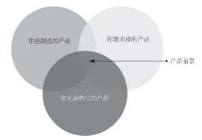
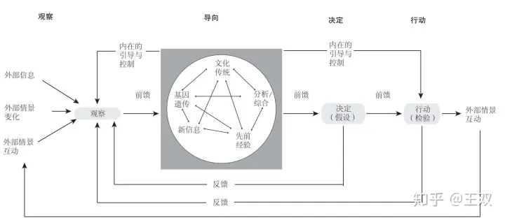
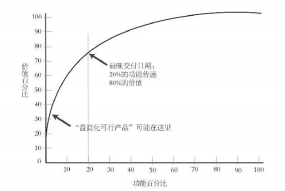
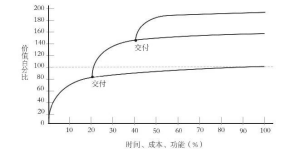

## 产品负责人必须权衡产品的多重属性

* 如果你只是把精力集中于自己能够制造的产品上，那么你的产品可能没人想要，即便你对这个产品充满热情也无济于事。
* 如果你只是把精力集中于自己能够卖掉的产品上，可能会给顾客许下不切实际的诺言，承诺一个生产不出来的产品。
* 如果你只是集中精力生产能卖掉、自己却没有热情的产品，那么你最后生产出来的产品可能会流于平庸。
* 三方交会的那个位置，则是最理想的，是建立在现实基础之上的美好前景，很有可能创造卓越。

# 一、待办事项清单：什么时候该做什么
## 在落实Scrum时，你需要做的第一件事情是拟定待办事项清单。
### 在撰写用户故事时，要设身处地地从用户视角思考问题
* 比如，“作为业主，我希望能看到门外的人，我想让他们进来就开门，不想让他们进来就不开门。”

### 待办事项清单背后的理念就是它必须囊括一项产品的所有功能。
* 你可能永远不会逐一落实上面的待办事项，但你只是想把一切因素列进去而已。

### 要在“先决定自己要做什么”这个问题上做出决定
* 哪些事项最有商业影响力？
* 哪些事项对顾客最重要？
* 哪些事项最有利可图？
* 哪些事项最容易实现？

### 产品开发中铁律：一个产品80%的价值来自20%的功能

# 二、产品负责人
## Scrum中，共有三类角色
* **开发团队成员**，负责开展具体的开发工作；
* **Scrum主管**，协助开发团队把事情做得更好；负责“怎么做”
* **产品负责人**，决定应该做什么工作，拟定待办事项清单的内容，最重要的是，确定各个事项的优先顺序。负责“做什么”

## 领导力与权力无关
* 领导力意味着知识，意味着领导者要像仆人那样服务他人。
* 必须向他人展示自己的方式是正确的和最佳的，必须说服或引导他人。

## 职责
* Scrum主管与团队成员的职责是确保工作快速完成，看看是否能进一步加快速度，提高效率
* 产品负责人的职责是把团队的效率转换成实实在在的价值。

## 产品负责人必须具备的4种特点
### 第一，产品负责人需要在相关领域内掌握丰富的专业知识。
* 产品负责人应该对团队目前正在采用的流程具有足够的了解
* 只有了解当前正在采用的流程，产品负责人才能知道哪些事情是真正有价值的。
* 产品负责人必须对市场有充分了解，才能得知怎样做才算有意义。

### 第二，产品负责人必须获得自主决策权。
* 管理层不应该干涉团队运作，产品负责人应该被授予决策权，才能自行决定产品的前景与如何实现前景。
* 产品负责人会面对来自公司内外利益相关者的巨大压力，他们必须拥有坚持做下去的权力。
* 产品负责人应该为结果 负责，但是他们要有自己的决策权。

### 第三，产品负责人必须有足够的时间与团队成员接触，向团队成员解释清楚需要做什么以及为什么要这么做。
* 团队成员的专业知识往往可以为产品负责人做出决策提供有益的帮助。
* 产品负责人必须值得信赖，言行一致，易于沟通。
* 如果团队成员无法接近产品负责人，那么他们就不知道自己该做什么，或者应该按照什么样的优先顺序落实待办事项。
* 团队成员依靠产品负责人了解产品的前景，也依靠产品负责人获取市场信息。

### 第四，产品负责人必须为价值负责。
* 在商业语境下，最重要的就是收益。
* 关键在于，要决定价值的衡量标准是什么，产品负责人要多创造价值。

# 三、决策回路：观察—导向—决定—行动

## `OODA循环`（Observe-OrientDecide-Act）“观察—导向—决定—行动”

### “观察”指看清外部情景的变化。
* 要摆脱自身的局限性，看到周围 所有情况的变化，而不仅仅从自己的视角去观 察。

### “导向”的结果如何，不仅与你所处位置有关，还与你看到了什么有关
* 与你能够为自己创造多少行动选项有关。
* 行动选项受到多重因素影响，包括基因遗传、文化传统和先前经验，当然也包括外部情景的变化。
* 这一环节不仅反映出你如何看待这个世界，以及你处于什么位置，也反映出你能看到什么样的世界。

### “观察”与“导向”结合在一起，产生了“决定”，从而催生了“行动”。然后，新的循环从“观察”开始。
* 这次观察的是你与对手的行动产生的结果。
* 在商业方面，观察对象就是市场的反应。

## Scrum 要求团队定期推出一些可行的新成果
* 为了使产品负责人看看新增成果能产生多少价值，看看人们的反应如何，获取反馈意见。
* 然后，就可以在这些反馈的基础上调整团队在下一个冲刺阶段中的行动，从而建立一个循环往复的意见反馈回路，
* 有助于加快创新与调整的速度，使产品负责人能够评估团队的活动创造了多少价值。
* 通过这种意见反馈回路，产品负责人就能够不断地调整团队努力的方向，应对不断变化的世界。
* 如何定期发布一些可行的新成果呢？
  * 关键在于找出哪些功能真正具有价值，以期取得反馈意见，并实时做出回应和调整。
  * 你越能更快地获得一些实际的反馈意见，就能越快做出更好的产品
## “最简化可行产品”
  * 要发布的东西至少能提供一点价值
  * 当你思考制造点什么东西时，不要预先认为不把所有事情做完就不能交付有价值的东西。
  * 是你首次展示给外界的东西
  * 应该尽快把具有基本使用功能的产品展示给公众，以便获取反馈意见，从而改进自己的决定，调整待办事项的优先顺序

# 四、重要的事情优先做

## 优先顺序处在不停的变动之中
* 每个冲刺阶段之后都会频繁出现待办事项清单上优 先顺序改变的情形
* 要认识到不确定性因素的存在，充分接受自己目前确定的优先顺序和创造的价值仅仅在当前是相对正确的，它将会持续不断地改变。

## “如果每件事你都想保卫，就等于什么都没有保卫。--普鲁士国王腓特烈二世
* 对于一家公司而言，很可能会出现这样一种坏习惯：由于市场需求不断变动，加上管理者无法准确得知什么最有价值，就把每一件事情列为优先事项。
* 不把手边资源与心力集中使用，结果就是会让它们稀释到无关紧要的地步

# 五、发布产品

> 应该尽快把具有基本使用功能的产品展示给公众，以便获取反馈意见，从而改进自己的决定，调整待办事项的优先顺序。

## “最简化可行产品”意义就在于获取用户的反馈意见
* 错误宁可早一点犯，因为早一点犯的话，可以尽量减少给别人造成的伤害，而且以后也可以想办法避免
* 意味着你可以先开发客户看重的功能，然后在整个产品的所有功能完成20%时发布
* 如果你想把产 品做到完美无缺时再发布，只会浪费发掘其他价值的机会。

## 正式发布或首次发布大型项目的成果时，要先调整一下自己的产品，确保其具备顾客需要的价值。

## “渐进式发布流程”
* 好处在于它是迭代 式的，可以反复进行。
* 有了这种流程，等你完成初始产品或计划的一半时，你就相当于用一半的时间创造了两倍的价值。
* 这是 Scrum 的真正优势所在
* 不要集中精力去开发出待办事项清单上的所有内容，而是要完成那些最有价值的功能，也就是人们真正需要的功能。
* 可以帮助你提前完成产品
* 你不必让团队绞尽脑汁开发其他什么功能，就可以发布了，而你的团队还可以着手实施下一个项目，在做其他事情时创造更多价值。

# 六、花冤枉钱与免费变更需求

## 控制需求变更无异于否定客户的真正需求。
* 努力限制成本的同时，也限制了学习、创新及创意。
* 传统的项目管理方法不但会妨碍你变更固有的需求，还会妨碍你以更快的速度创造价值。

## 严格控制成本的措施根本行不通

## “免费变更需求”
* 在一个标准的固定价格合同中，列出你期望的所有功能，然后专门添加一款关于免费变更需求的条文。
  * 在合同刚开始的3个月内，客户支付给这家Scrum公司150万美元。
  * 为了提前终止合同，他们还必须额外支付剩余的850万美元中的20%，也就是170万美元。
  * 他们总共支付了320万美元，得到的是自己原本认为价值1000万美元的软件，而且还提前17个月拿到了产品。
  * 软件开发公司原本预期的赢利率是15%，但是在前3个月里只花费了130万美元开发软件，却收到了320万美元的报酬，从而使得获利率从15%提高到了60%，提高了3倍。开发人员提前收工，又可以竞标别的项目了。

## 之所以能做到这一点，因为他们采用了 Scrum 方法
#### 开发团队是多功能团队，能够加快工作速度，以更快的速度传递出更多价值。
#### 每一个冲刺阶段结束后，他们都会推出具备新功能的产品。这种产品是可以使用的，而且立即就可以投入使用。
#### 在每一个冲刺阶段结束后，产品负责人都能根据顾客反馈的意见重新安排待办事项的优先顺序。
#### 只要为客户创造了足够的价值，所有人都可以收工了。
#### Scrum把所有人的利益凝聚在了一起，包括开发团队成员、Scrum主管、产品负责人、客户以及公司的利益。
#### 每个人都会朝着同样的目标而努力。这个目标就是尽快创造出切切实实的价值。

# 七、风险
## Scrum能够为你降低失败风险。
* 三个最常见的风险类型是`市场风险`、`技术风险`和`财务风险`。

### Scrum方法注重渐进式迭代，可以帮助你把市场风险降到最低，可以帮你更快地把产品展示给客户。
* 很早就可以收集用户反馈的意见，而且可以经常收集这样的意见，你就可以实时对产品做出小改动，不必非要等到你已经投进去数百万美元、意识到产品不符合客户需求之后才被迫做出大幅调整。

### 技术风险很值得关注。
* 客户不是根据理论上的产品结构做判断，而是看到和触摸到实物之后才能做判断。
* 往往会先做出几种具备基本功能、完全可以使用的原型产品，然后加以比较，选定最佳者。

### 大部分公司的倒闭都是由财务风险引起的
* 做出某种很酷的产品后，销量却不理想，无法赢利。
* 另一个诱发企业倒闭的原因是为了招揽客户而付出过多费用。

## Scrum能够帮助企业迅速回答一个关键的问题：我们做这个产品能挣到钱吗？
* 渐进式迭代能帮你发现客户重视什么，以及客户愿意为什么样的产品掏腰包。
* 即便第一次猜测失误，你也可以立即根据客户反馈的意见做出调整，你的损失最多是在前几个冲刺阶段中投入的时间与精力。

# 八、明天，你要这么做

## 应该怎样把Scrum落实到自己 的工作中呢？

### 首先是拟定待办事项清单和组建团队。
* 想一想产品或服务的前景如何，然后着手把实现这个前景而必须做的事情分解成诸多小的待办事项。
* 等到团队成员开始第一个冲刺阶段、举办每日立会之际，可以利用这些时间拟定充足的待办事项清单，以便让团队在之后两个冲刺阶段中有事可做。
* 要时刻盯着待办事项清单，因为随着团队开发工作的推进，效率会越来越高，他们可能会创造出你认为不可能的成果。

### 接下来，作为产品负责人，你要制作一张工作路线图。
* “这个季度能取得多少成果？”、“今年一年取得什么成果”只是你当下的想法，没必要列得太详细，只要做出评估就可以了
* 你并不是在为团队制定一份具有约束力的合同，而是在梳理自己对于今后工作的想法。
* 这种规划，就是要给团队内部的工作增加一些`透明度`。
* 每一件事都被置于公开状态之下，每个人在任何时间都能看到产品的开发进度，他们可以看到一个“用户故事”从白板的“待办事项”栏挪到了“完成事项”栏。
* 这种白板能够显示出待办事项的完成状态，再搭配上“燃尽图”会更有帮助。
  * 任何人都可以绘制燃尽图，
  * 任何人都清楚地知道团队在上一个冲刺阶段中完成了多少用户故事，以及在下一个冲刺阶段中将要完成多少用户故事。
* 作为产品负责人，你的业绩衡量指标就 是收入与成本。

# 要点
## 拟定待办事项清单，检查两遍。
* 先列出 一个项目中可能涉及的所有事项，然后确定优先顺序，把价值最高、风险最低的事项置于最优先的位置，然后依次往下列。

## 产品负责人。
* 产品负责人的职责是把美好的愿景转变成待办事项清单。
* 他必须懂项目，懂市场，懂顾客。

## 领导者不是上司。
* 产品负责人明确要做 哪些事，以及为什么要做。
* 至于如何落实以及让谁落实，则交给团队成员决定。

## 观察—导向—决定—行动。
* 战略上着眼于全局，策略上迅速行动。

## 恐惧、不确定性及疑惑。
* 主动出击胜过被动挨打。
* 了解竞争对手的“观察—导向— 决定—行动”循环，当他们陷入疑惑之际将其打败。

## 花冤枉钱与免费变更需求。
* 如果发现某个新的待办事项有价值，那就做吧。
* 很可能需要变更既定的待办事项，如果有必要，就删掉一个需要耗费同 等精力的既定待办事项，用新的待办事项取而代之。
* 有些事项，你一开始觉得有必要， 实际上可能并非如此。