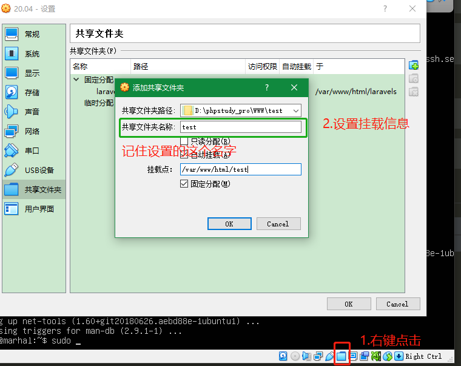
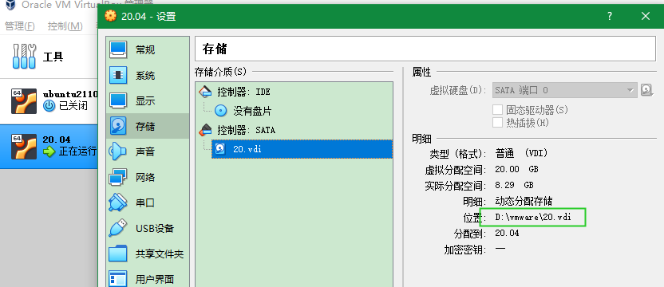

- [Linux Command](#linux-command)
- [win10查看端口占用](#win10查看端口占用)
- [win10下ubuntu子系统与windows的目录影射](#win10下ubuntu子系统与windows的目录影射)
- [ubuntu时区设置](#ubuntu时区设置)
- [curl](#curl)
- [SSH](#ssh)
- [k8s Command](#k8s-command)
- [NPM Command](#npm-command)
- [virtualbox 配置ubuntu固定ip](#virtualbox-配置ubuntu固定ip)
- [virtualbox挂载目录](#virtualbox挂载目录)
  - [在主界面设置好挂载信息](#在主界面设置好挂载信息)
  - [命令](#命令)
- [解决ubuntu上回环设备/dev/loop0占用100%的问题](#解决ubuntu上回环设备devloop0占用100的问题)
- [解决virtualbox 虚拟机磁盘空间不足](#解决virtualbox-虚拟机磁盘空间不足)
- [dash-bash](#dash-bash)
- [linux-windows 文件格式问题](#linux-windows-文件格式问题)
  - [查看文件格式](#查看文件格式)
  - [docs 转 unix](#docs-转-unix)
- [virtualbox安装镜像后无网络解决](#virtualbox安装镜像后无网络解决)
  - [镜像下载地址](#镜像下载地址)
- [centos软件安装源地址](#centos软件安装源地址)
- [Host key verification failed.](#host-key-verification-failed)
- [高版本ubuntu安装低版本php](#高版本ubuntu安装低版本php)

## <a id="Linux">Linux Command</a>

```bash
## 查看开机自启项
systemctl list-unit-files --type=service|grep enabled
## 关闭开机自启项
sudo systemctl disable apache2.service
sudo systemctl disable nginx.service
## 查看文件前几行
head -n 10 /test.sql
## 查看文件后几行
tail -n 10 /test.sql
## 将文件的前/后几行输出到指定文件
head/tail -n 10 /test.sql >> /test10.sql
## 从第3000行开始，显示1000行（显示3000~3999行）
cat filename.txt | tail -n +3000 | head -n 1000
## 显示1000行到3000行
cat filename.txt | head -n 3000 | tail -n +1000 
sed -n '1000,3000p' filename.txt


## nohup
### 默认输出日志在nohup.out
nohup [command] & 
### 指定输出日志文件
nohup [command] > [logPath] 2>&1 & 

## 查看nohup输出
tail - 200f nohup.out

## 查看任务
jobs

## 查看进程
ps -aux | grep php

# 查看当前目录文件的大小
du -sh *

# 文件内容替换
## 替换文件中的内容 text->replace 
sed -i 's/[text]/[replaceText]/' [file]
sed -i "s/;openssl.cafile=/openssl.cafile=\/usr\/lib\/ssl\/cacert.pem/g" /usr/local/php/etc/php.ini

## 移除文件中的空白行
sed '/^$/d' [file]

## 查看端口
netstat -ntlp | grep LISTEN
netstat -an | grep 5601

## ping端口
yum install -y telnet
apt install -y telnet
telnet [ip] [port]
telnet 172.0.0.1 9000
```

## <a id="win10-port">win10查看端口占用</a>
```bash
PS C:\Users\penk009> netstat -aon|findstr 3306
  TCP    127.0.0.1:3306         0.0.0.0:0              LISTENING       4352
  TCP    [::1]:3306             [::]:0                 LISTENING       14900
PS C:\Users\penk009> tasklist|findstr 4352
  mysqld.exe                    4352 Services                   0     48,536 K
  
# 去“服务”查找mysqld.exe
```


## <a id="win10-Linux">win10下ubuntu子系统与windows的目录影射</a>
```
WSL和Windows主系统之间的文件系统是可以互相访问的

如果在WSL中访问Windows系统的文件，可在根目录下/mnt/看到对应Windows盘符字母的文件夹，通过这些文件夹即可访问Windows的文件系统。

如果在Windows系统中访问WSL的文件,Windows系统中找到已安装Linux发行版的应用数据文件夹，所有Linux系统的数据都在那个文件夹(C:\Users\{你的用户名}\AppData\Local\Packages\{Linux发行版包名}\LocalState\rootfs)
C:\Users\Administrator\AppData\Local\Packages\CanonicalGroupLimited.UbuntuonWindows_79rhkp1fndgsc\LocalState\rootfs
```

## <a id="ubuntu-date">ubuntu时区设置</a>
```bash
# 查看当前系统时间
marhal@marhal:~$ date -R 
# Wed, 08 Dec 2021 09:57:52 +0000

# 设置时区
marhal@marhal:~$ tzselect
# 依次选择`亚洲(Asia)`,`中国(China)`,选择`北京(Beijing)`,选择 `是(YES)`
# 依次输入 4           10               1                  1


marhal@marhal:~$ sudo cp /usr/share/zoneinfo/Asia/Shanghai  /etc/localtime
marhal@marhal:~$ date -R 
# Wed, 08 Dec 2021 17:59:07 +0800
```

## <a id="curl">curl</a>

* 使用POST登录保存cookie文件
```bash
curl -k -X POST -c cookie.txt --header 'Content-Type: application/json' -d{"name"="18800000000","psd"="Admin123"} http://aa.com
```

* 使cookie文件POST登录

```bash
curl 
	-XPOST 
	-d '{"cellphone":"18800000000","password":"PXpassword0000"}' 
	--header "Content-Type: application/json;charset=UTF-8" 
	-c cookie_xx  
	http://oa.credit.com/api/signIn
```

* 使cookie文件GET查询
```bash
curl -b cookie.txt http://xxx.com
```

## <a id="ssh">SSH</a>

* ssh连接远程服务器
```bash
ssh -p 1211 marhal@47.93.45.242
```

* ssh中文乱码
```bash
export LANG=C
export LC_ALL=zh_CN.utf-8
export LANG=zh_CN.utf-8
```

## <a id="k8s">k8s Command</a>

```bash
ssh -D 127.0.0.1:8080 dev@47.96.157.236 -p 17456 -i /Users/apple/Documents/id_rsa_credit_sanbox

ssh -p 17456 172.25.1.1

# 获取命名空间
kubectl get namespaces;
# 获取命名空间下的容器
kubectl get pods -n=credit-ll
# 构建
kubectl edit deployment/credit-backend -n=credit-ll
# 进入容器
kubectl exec -it credit-backend -n=credit-ll -c=phpfpm bash
# 日志
kubectl logs -f credit-portal-6557fc89bf-x6l2t -n=credit-ty -c=phpfpm
```

## <a id="npm">NPM Command</a>

```bash
# 注册模块镜像
npm set registry https://registry.npm.taobao.org 
yarn config set registry https://registry.npm.taobao.org/
# node-gyp 编译依赖的 node 源码镜像
npm set disturl https://npm.taobao.org/dist 
# 以下选择添加
## chromedriver 二进制包镜像
npm set chromedriver_cdnurl http://cdn.npm.taobao.org/dist/chromedriver
## operadriver 二进制包镜像
npm set operadriver_cdnurl http://cdn.npm.taobao.org/dist/operadriver
## phantomjs 二进制包镜像
npm set phantomjs_cdnurl http://cdn.npm.taobao.org/dist/phantomjs
## node-sass 二进制包镜像
npm set sass_binary_site http://cdn.npm.taobao.org/dist/node-sass
## electron 二进制包镜像
npm set electron_mirror http://cdn.npm.taobao.org/dist/electron/ 
# 清空缓存
npm cache clean
```

## <a id="virtualbox-ubuntu-ip">virtualbox 配置ubuntu固定ip</a>
```bash
marhal@marhal:~$ cd /etc/netplan
marhal@marhal:~$ sudo cp /etc/netplan/00-installer-config.yaml /etc/netplan/00-installer-config.yaml.bak
marhal@marhal:~$ sudo vim 00-installer-config.yaml
```
替换内容
```yaml
network:
  ethernets:
    enp0s3:
      dhcp4: no
      addresses: [172.16.0.188/23]
      gateway4: 172.16.0.1
      nameservers:
              addresses: [172.16.0.1, 144.144.144.144]
  version: 2
```
```bash
marhal@marhal:~$ sudo netplan apply
marhal@marhal:~$ sudo vim /etc/resolv.conf
```

修改 nameserver

```text
nameserver 114.114.114.114
```
```bash
marhal@marhal:~$ source ~/.bashrc
```

## <a id="virtualbox-ubuntu-mount">virtualbox挂载目录</a>

### 在主界面设置好挂载信息



### 命令
```bash
### 格式
### sudo mount -t vboxsf 共享文件夹名称（在设置页面设置的） 挂载的目录
:~$ sudo mount -t vboxsf test /var/www/html/test
```

## 解决ubuntu上回环设备/dev/loop0占用100%的问题
```bash
cat /etc/issue
# Ubuntu 20.04.3 LTS \n \l

# 查看文件系统占用情况
df -h
# df -i 查看inode使用情况
# 查看所有回环设备
losetup

# 镜像文件挂载到一个目录下
mount -o loop xxx.iso /media
## 等同于
## losetup /dev/loop0 xxx.iso
## mount /dev/loop0 /media

# 清理方法
sudo apt autoremove --purge snapd

```

## 解决virtualbox 虚拟机磁盘空间不足
* 查看存储位置
* 
* 进入 Dos (win+r 键入 cmd 然后 enter)
* 进入 VirtualBox 安装目录

```bash
# 扩容至20G 1024MB*20
D:\Program Files\Oracle\VirtualBox> VBoxManage modifyhd "D:\vmware\20.vdi" --resize 20480
# 0%...10%...20%...30%...40%...50%...60%...70%...80%...90%...100%
```

* 进入虚拟机

```bash
root@marhal:~# fdisk -l

# Disk /dev/sda: 20 GiB, 21474836480 bytes, 41943040 sectors
# Disk model: VBOX HARDDISK   
# Units: sectors of 1 * 512 = 512 bytes
# Sector size (logical/physical): 512 bytes / 512 bytes
# I/O size (minimum/optimal): 512 bytes / 512 bytes
# Disklabel type: gpt
# Disk identifier: B9086253-DC80-4542-851A-BDA95A350D40
# 
# Device        Start      End  Sectors  Size Type
# /dev/sda1      2048     4095     2048    1M BIOS boot
# /dev/sda2      4096  2101247  2097152    1G Linux filesystem
# /dev/sda3   2101248 20969471 18868224    9G Linux filesystem
# /dev/sda4  41943006 41943006        1  512B Linux filesystem
# 
# 
# Disk /dev/mapper/ubuntu--vg-ubuntu--lv: 8.102 GiB, 9659482112 bytes, 18866176 sectors
# Units: sectors of 1 * 512 = 512 bytes
# Sector size (logical/physical): 512 bytes / 512 bytes
# I/O size (minimum/optimal): 512 bytes / 512 bytes

```

* 增加了空间的磁盘 `/dev/sda`
* 查看一下调整后的磁盘状态

```bash
## 查看一下调整后的磁盘状态
root@marhal:~# fdisk -l /dev/sda
# GPT PMBR size mismatch (20971519 != 41943039) will be corrected by write.
# The backup GPT table is not on the end of the device. This problem will be corrected by write.
# Disk /dev/sda: 20 GiB, 21474836480 bytes, 41943040 sectors
# Disk model: VBOX HARDDISK   
# Units: sectors of 1 * 512 = 512 bytes
# Sector size (logical/physical): 512 bytes / 512 bytes
# I/O size (minimum/optimal): 512 bytes / 512 bytes
# Disklabel type: gpt
# Disk identifier: B9086253-DC80-4542-851A-BDA95A350D40
# 
# Device       Start      End  Sectors Size   Type
# /dev/sda1     2048     4095     2048   1M   BIOS boot
# /dev/sda2     4096  2101247  2097152   1G   Linux filesystem
# /dev/sda3  2101248 20969471 18868224   9G   Linux filesystem
# /dev/sda3  41943006 41943006 1         512B Linux filesystem

## 磁盘分区
root@marhal:~# fdisk /dev/sda
# Welcome to fdisk (util-linux 2.34).
# Changes will remain in memory only, until you decide to write them.
# Be careful before using the write command.

## 查看帮助
Command (m for help): m
# Help:
# 
#   GPT
#    M   enter protective/hybrid MBR
# 
#   Generic
#    d   delete a partition
#    F   list free unpartitioned space
#    l   list known partition types
#    n   add a new partition
#    p   print the partition table
#    t   change a partition type
#    v   verify the partition table
#    i   print information about a partition
# 
#   Misc
#    m   print this menu
#    x   extra functionality (experts only)
# 
#   Script
#    I   load disk layout from sfdisk script file
#    O   dump disk layout to sfdisk script file
# 
#   Save & Exit
#    w   write table to disk and exit
#    q   quit without saving changes
# 
#   Create a new label
#    g   create a new empty GPT partition table
#    G   create a new empty SGI (IRIX) partition table
#    o   create a new empty DOS partition table
#    s   create a new empty Sun partition table

Command (m for help): n
# Partition type:
#    p   primary (2 primary, 0 extended, 2 free)
#    e   extended
Select (default p): p
## 分区号 默认5 上面1-4都已经被使用了
Partition number (5-128, default 5): 5
First sector (20969472-41943005, default 20969472): 
## 直接回车
Last sector, +/-sectors or +/-size{K,M,G,T,P} (20969472-41943006, default 41943006): 
## 可以直接回车但是我提示错误就稍微小一点
# Value out of range.
# Last sector, +/-sectors or +/-size{K,M,G,T,P} (20969472-41943006, default 41943006): 41943000
# 
# Created a new partition 5 of type 'Linux filesystem' and of size 10 GiB.
# 
Command (m for help): t
Partition number (1-5, default 5): 5
## Hex 代码(输入 L 列出所有代码)
Partition type (type L to list all types): 8e
# Type of partition 5 is unchanged: Linux filesystem.
## 写分区表，完成后退出fdisk命令
Command (m for help): w
# The partition table has been altered.
# Syncing disks.
```
* 使用 `partprobe` 重新读取分区表，或者重启机器

```bash
root@marhal:~# partprobe
```

* 查看

```bash
root@marhal:~# fdisk -l
# Disk /dev/sda: 20 GiB, 21474836480 bytes, 41943040 sectors
# Disk model: VBOX HARDDISK   
# Units: sectors of 1 * 512 = 512 bytes
# Sector size (logical/physical): 512 bytes / 512 bytes
# I/O size (minimum/optimal): 512 bytes / 512 bytes
# Disklabel type: gpt
# Disk identifier: B9086253-DC80-4542-851A-BDA95A350D40
# 
# Device        Start      End  Sectors  Size Type
# /dev/sda1      2048     4095     2048    1M BIOS boot
# /dev/sda2      4096  2101247  2097152    1G Linux filesystem
# /dev/sda3   2101248 20969471 18868224    9G Linux filesystem
# /dev/sda4  41943006 41943006        1  512B Linux filesystem
# /dev/sda5  20969472 41943000 20973529   10G Linux filesystem
# 
# Partition table entries are not in disk order.
# 
# 
# Disk /dev/mapper/ubuntu--vg-ubuntu--lv: 8.102 GiB, 9659482112 bytes, 18866176 sectors
# Units: sectors of 1 * 512 = 512 bytes
# Sector size (logical/physical): 512 bytes / 512 bytes
# I/O size (minimum/optimal): 512 bytes / 512 bytes
```

* 格式化分区

```bash
root@marhal:~# mkfs.ext3 /dev/sda5
# mke2fs 1.45.5 (07-Jan-2020)
# Creating filesystem with 2621440 4k blocks and 656640 inodes
# Filesystem UUID: 74eb35db-0eda-45bc-8a8f-8bfc2c63c2bd
# Superblock backups stored on blocks: 
# 	32768, 98304, 163840, 229376, 294912, 819200, 884736, 1605632
# 
# Allocating group tables: done                            
# Writing inode tables: done                            
# Creating journal (16384 blocks): done
# Writing superblocks and filesystem accounting information: done 
```

* 添加新LVM到已有的LVM组，实现卷扩容

```bash
root@marhal:~# lvm
## 初始化刚才的分区
lvm> pvcreate /dev/sda5
WARNING: ext3 signature detected on /dev/sda5 at offset 1080. Wipe it? [y/n]: y
#   Wiping ext3 signature on /dev/sda5.
#   Physical volume "/dev/sda5" successfully created.

## 查看卷和卷组
lvm> vgdisplay
#   --- Volume group ---
#   VG Name               ubuntu-vg
#   System ID             
#   Format                lvm2
#   Metadata Areas        1
#   Metadata Sequence No  2
#   VG Access             read/write
#   VG Status             resizable
#   MAX LV                0
#   Cur LV                1
#   Open LV               1
#   Max PV                0
#   Cur PV                1
#   Act PV                1
#   VG Size               <9.00 GiB
#   PE Size               4.00 MiB
#   Total PE              2303
#   Alloc PE / Size       2303 / <9.00 GiB
#   Free  PE / Size       0 / 0   
#   VG UUID               2Bvs4e-w3lX-ZpMw-zcu5-nsaW-j5g6-bnm9dT

##   将初始化过的分区加入到虚拟卷组 （ubuntu-vg 来源于上面的 VG Name）
lvm> vgextend ubuntu-vg /dev/sda5
#   Volume group "ubuntu-vg" successfully extended

## 扩展已有卷的容量（/dev/mapper/ubuntu--vg-ubuntu--lv 来源于 `fdisk -l` 或者 `df -h` 时 100%占用的那个）
lvm> lvextend -l +81920 /dev/mapper/ubuntu--vg-ubuntu--lv
#   Insufficient free space: 81920 extents needed, but only 2559 available

lvm> lvextend -l +2559 /dev/mapper/ubuntu--vg-ubuntu--lv
#   Size of logical volume ubuntu-vg/ubuntu-lv changed from <9.00 GiB (2303 extents) to 18.99 GiB (4862 extents).
#   Logical volume ubuntu-vg/ubuntu-lv successfully resized.

lvm> pvdisplay
#   --- Physical volume ---
#   PV Name               /dev/sda3
#   VG Name               ubuntu-vg
#   PV Size               <9.00 GiB / not usable 0   
#   Allocatable           yes (but full)
#   PE Size               4.00 MiB
#   Total PE              2303
#   Free PE               0
#   Allocated PE          2303
#   PV UUID               3qT2Nv-MyT0-UoXF-dp6a-ZEcO-I6nD-QedADW
#    
#   --- Physical volume ---
#   PV Name               /dev/sda5
#   VG Name               ubuntu-vg
#   PV Size               10.00 GiB / not usable 4.98 MiB
#   Allocatable           yes (but full)
#   PE Size               4.00 MiB
#   Total PE              2559
#   Free PE               0
#   Allocated PE          2559
#   PV UUID               eR5hUQ-fxji-aIT7-5Q1P-1qnK-M03e-5LeExM
   
lvm> quit
#   Exiting.
```

* 对文件系统实现真正扩容

```bash
root@marhal:~# xfs_growfs /dev/mapper/ubuntu--vg-ubuntu--lv
# xfs_growfs: /dev/mapper/ubuntu--vg-ubuntu--lv is not a mounted XFS filesystem
root@marhal:~# resize2fs /dev/mapper/ubuntu--vg-ubuntu--lv
# resize2fs 1.45.5 (07-Jan-2020)
# Filesystem at /dev/mapper/ubuntu--vg-ubuntu--lv is mounted on /; on-line resizing required
# old_desc_blocks = 2, new_desc_blocks = 3
# The filesystem on /dev/mapper/ubuntu--vg-ubuntu--lv is now 4978688 (4k) blocks long.

root@marhal:~# df -h
# Filesystem                         Size  Used Avail Use% Mounted on
# udev                               445M     0  445M   0% /dev
# tmpfs                               98M  808K   97M   1% /run
# /dev/mapper/ubuntu--vg-ubuntu--lv   19G  8.8G  9.0G  50% /
# tmpfs                              489M     0  489M   0% /dev/shm
# tmpfs                              5.0M     0  5.0M   0% /run/lock
# tmpfs                              489M     0  489M   0% /sys/fs/cgroup
# /dev/sda2                          976M  205M  705M  23% /boot
```

## <a id="dash2bash">dash-bash</a>
```bash
## 从 ubuntu 6.10 开始，ubuntu 就将先前默认的bash shell 更换成了dash shell；
## 表现为 /bin/sh 链接到了/bin/dash 而不是传统的 /bin/bash
## dash不支持C语言格式的for循环写法
marhal@marhal:~$ ls -l /bin/sh
## lrwxrwxrwx 1 root root 4 Aug 24 16:42 /bin/sh -> dash

# 将默认shell更改为bash
marhal@marhal:~$ sudo dpkg-reconfigure dash
# 在弹出的框选择 No
## Removing 'diversion of /bin/sh to /bin/sh.distrib by dash'
## Adding 'diversion of /bin/sh to /bin/sh.distrib by bash'
## Removing 'diversion of /usr/share/man/man1/sh.1.gz to /usr/share/man/man1/sh.distrib.1.gz by dash'
## Adding 'diversion of /usr/share/man/man1/sh.1.gz to /usr/share/man/man1/sh.distrib.1.gz by bash'

```

## <a id="filestype">linux-windows 文件格式问题</a>

### <a id="filestype1">查看文件格式</a>
```bash
# 查看文件格式
cat -A filename
## dos格式的文件行尾为^M$，unix格式的文件行尾为$


vi filename
## 打开文件，执行 : set ff，如果文件为dos格式在显示为fileformat=dos，如果是unxi则显示为fileformat=unix

od -t x1 filename
## 输出内容中存在0d 0a,是dos格式
## 如果只有0a，则是unix格式
```

### <a id="filestype2">docs 转 unix</a>

```bash
# docs 转 unix
## 方法一
sed -i "s/\r//" filename
## 方法二
vim filename
### 进入filename后在底部模式下， 执行:set fileformat=unix后执行:x或者:wq保存修改。
## 方法三：使用dos2unix 
sudo apt-get install dos2unix 
dos2unix filename

```

## <a id="centosvbnetwork">virtualbox安装镜像后无网络解决</a>

### 镜像下载地址
* [Download](http://mirror.nsc.liu.se/centos-store/)

```bash
vi /etc/sysconfig/network-scripts/ifcfg-enp0s3

# ONBOOT=no 改完 ONBOOT=yes
```

## <a id="centosrepository">centos软件安装源地址</a>
```text
https://ftp.sjtu.edu.cn/centos/8-stream/BaseOS/x86_64/os/
https://mirrors.aliyun.com/centos/8-stream/BaseOS/x86_64/os/
https://mirrors.ustc.edu.cn/centos/8-stream/BaseOS/x86_64/os/
https://mirrors.njupt.edu.cn/centos/8-stream/BaseOS/x86_64/os/
https://mirrors.163.com/centos/8-stream/BaseOS/x86_64/os/
https://mirrors.huaweicloud.com/centos/8-stream/BaseOS/x86_64/os/
https://mirrors.tuna.tsinghua.edu.cn/centos/8-stream/BaseOS/x86_64/os/
https://mirrors.neusoft.edu.cn/centos/8-stream/BaseOS/x86_64/os/
https://mirrors.cqu.edu.cn/centos/8-stream/BaseOS/x86_64/os/
https://mirrors.bfsu.edu.cn/centos/8-stream/BaseOS/x86_64/os/
https://mirrors.nju.edu.cn/centos/8-stream/BaseOS/x86_64/os/

https://mirrors.aliyun.com/centos/8/BaseOS/x86_64/os/
https://mirrors.aliyun.com/centos/8/AppStream/x86_64/os/


```

## <a id="HostKeyVerificationFailed">Host key verification failed.</a>
```bash
ssh-keygen -R [ip]
```

## <a id="ubuntuinstallphp">高版本ubuntu安装低版本php</a>
```bash
sudo add-apt-repository ppa:ondrej/php
sudo apt-get -y install php7.0
```