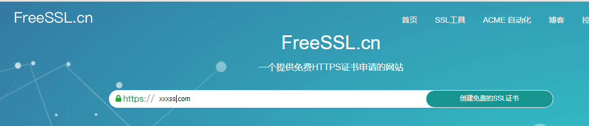
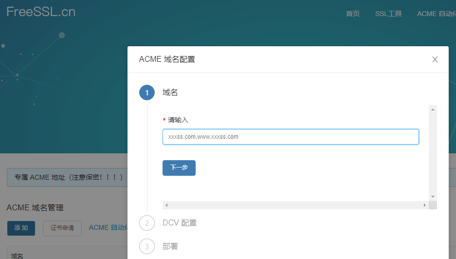
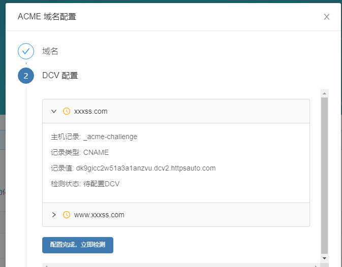
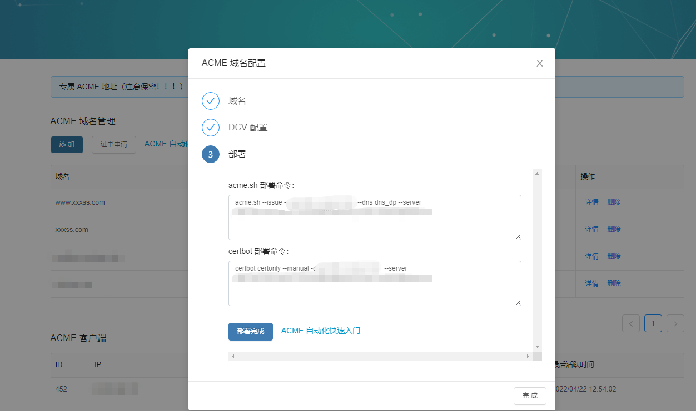
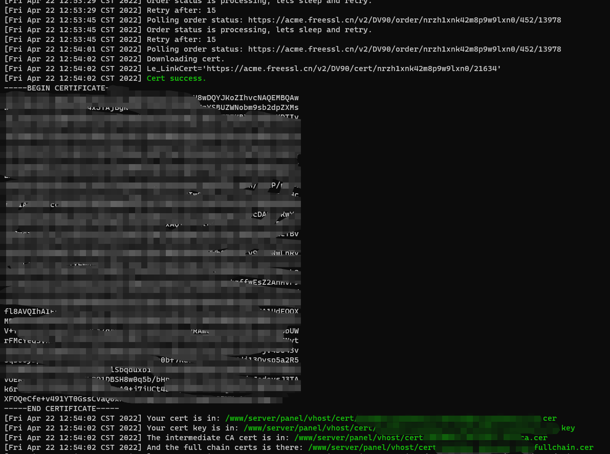
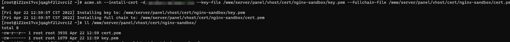

# freessl 配置免费证书

## [官网](https://freessl.cn/)

## 步骤

### 1.输入自己的域名


### 2.输入要配置的域名，点击下一步


### 3.去配置域名解析，检测成功



### 4.`acme.sh` 部署

```bash
acme.sh --issue -d [domainHost]  --dns dns_dp --server https://acme.freessl.cn/v2/DV90/directory/xxxxxxxxxxxxxx
```



### 5. [ACME v2证书自动化](https://blog.freessl.cn/acme-quick-start/)

```bash
curl https://gitcode.net/cert/cn-acme.sh/-/raw/master/install.sh?inline=false | sh -s email=my@example.com

mv acme.sh /usr/local/bin/

```

### 6.1 nginx  部署
```bash
acme.sh --install-cert -d example.com \
--key-file       /path/to/keyfile/in/nginx/key.pem  \
--fullchain-file /path/to/fullchain/nginx/cert.pem \
--reloadcmd     "service nginx force-reload"
```



### 6.2 apache  部署
```bash
acme.sh --install-cert -d example.com \
--cert-file      /path/to/certfile/in/apache/cert.pem  \
--key-file       /path/to/keyfile/in/apache/key.pem  \
--fullchain-file /path/to/fullchain/certfile/apache/fullchain.pem \
--reloadcmd     "service apache2 force-reload"
```

### 7. 开放`443`端口
### 8. 宝塔配置`其他ssl`后的`nginx`配置文件
```bash
server
{
    listen 80;
	listen 443 ssl http2;
    server_name sandbox.xxxxx.vip;
    index index.php index.html index.htm default.php default.htm default.html;
    root /www/wwwroot/xxxxx/public;
    
    #SSL-START SSL相关配置，请勿删除或修改下一行带注释的404规则
    #error_page 404/404.html;
    ssl_certificate    /www/server/panel/vhost/cert/xxxxx/fullchain.pem;
    ssl_certificate_key    /www/server/panel/vhost/cert/xxxxx/privkey.pem;
    ssl_protocols TLSv1.1 TLSv1.2 TLSv1.3;
    ssl_ciphers EECDH+CHACHA20:EECDH+CHACHA20-draft:EECDH+AES128:RSA+AES128:EECDH+AES256:RSA+AES256:EECDH+3DES:RSA+3DES:!MD5;
    ssl_prefer_server_ciphers on;
    ssl_session_cache shared:SSL:10m;
    ssl_session_timeout 10m;
    add_header Strict-Transport-Security "max-age=31536000";
    error_page 497  https://$host$request_uri;


    #SSL-END
}
```