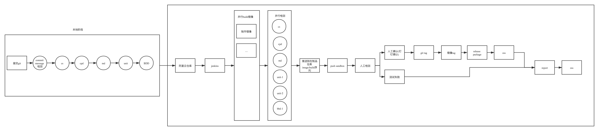
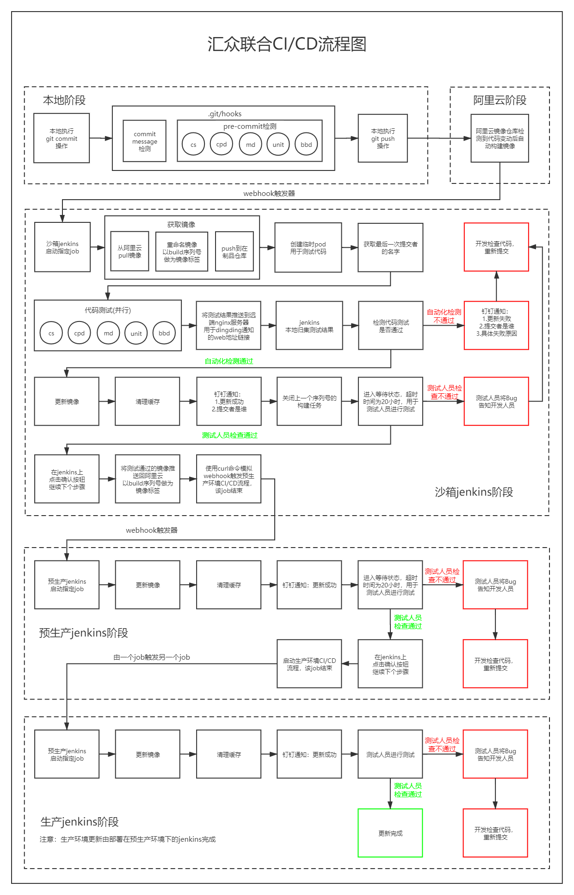
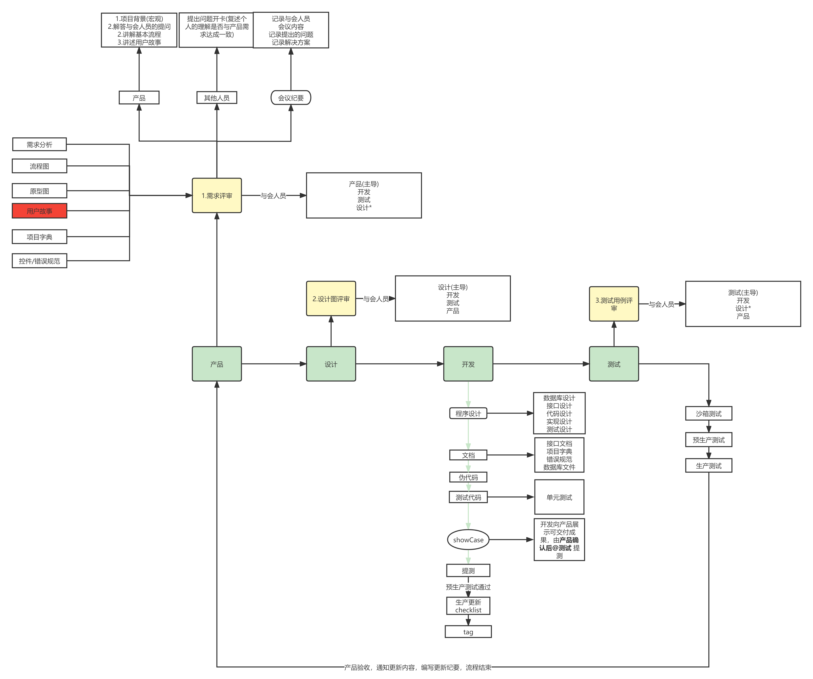

- [研发流程](#研发流程 )
  - [理论依据](#理论依据 )
  - [实践依据](#实践依据 )
  - [现状分析](#现状分析 )
    - [产品](#产品 )
    - [开发](#开发 )
    - [运维](#运维 )
    - [团队](#团队 )
  - [实施方案](#实施方案 )
    - [产品](#产品-1 )
      - [需求](#需求 )
      - [影响地图](#影响地图 )
      - [用户故事](#用户故事 )
      - [看板方法](#看板方法 )
      - [迭代DoD(Definition of Done)-完成的定义](#迭代doddefinition-of-done-完成的定义 )
    - [开发](#开发-1 )
    - [编码规范](#编码规范 )
    - [编码思想](#编码思想 )
      - [面向对象编程](#面向对象编程 )
    - [开发SOP](#开发sop )
      - [基本理论](#基本理论 )
      - [1.程序设计](#1程序设计 )
      - [2.文档](#2文档 )
      - [3.编码](#3编码 )
      - [4.测试](#4测试 )
      - [新人培训](#新人培训 )
    - [测试](#测试 )
    - [运维](#运维-1 )
      - [环境](#环境 )
      - [日志](#日志 )
      - [备份](#备份 )
      - [监控平台](#监控平台 )
      - [CI/DI 流程图](#cidi-流程图 )
    - [团队改善](#团队改善 )
      - [持续改进：`PDCA`循环](#持续改进pdca循环 )
      - [目标管理原则 `SMART`](#目标管理原则-smart )
      - [`二八定律`](#二八定律 )
    - [会议](#会议 )
  - [参考书籍](#参考书籍 )
    - [项目管理](#项目管理 )
    - [开发](#开发-2 )
      - [代码规范](#代码规范 )
      - [编程思想](#编程思想 )
    - [DevOps](#devops )
  - [结束语](#结束语 )
  - [附：](#附 )
    - [1.汇众联合CI/DI流程图](#1汇众联合cidi流程图 )
    - [2.研发流程闭环](#2研发流程闭环 )
  
#  研发流程
  
  
---
  
##  理论依据
  
* **敏捷项目管理**
  * 价值驱动交付
* **DevOps实践指南**
  * 持续集成CI（Continuous Integration）
  * 持续交付CD（Continuous Delivery）
* **领域驱动编程**(DDD+CQRS+六边形模型)
  
##  实践依据
  
* 北京企信云信息科技有限公司
  * 信用平台实现1.0到2.0的升级
  * 汇众联合
  
##  现状分析
  
###  产品
  
* 产品文档就是原型图，没有可落地可追溯的文件
* 可交付成果界限模糊
* 缺少验收环节
  
###  开发
  
* 代码风格不一致，可读性差，维护性差
* 编码思想倾向于面向过程开发，系统耦合度极高，维护性差
* 代码没有单元测试
* 开发文档不全，维护率低
* 代码存在大量的魔术数字
* 本地开发环境与发布环境不统一
* MySQL 
  * 连表过多，经常 gone away
  * 表名、字段规范不严格
* 未使用缓存，所有请求直接落地数据库
* 没有相关单元测试，所有功能力求实现，不求效率规范和可维护
  
###  运维
  
* docker镜像集中，没有拆分
  * 每一个服务应该是单独的镜像
  * 镜像最小化原则，不安装不需要的软件
* 服务监控缺失
  * 磁盘监控
  * 集群监控
  * ...
* CI/DI 不够健全
  * 代码应该通过自动化构建部署，而不可以人为修改更新
* 服务器基本安全不到位
  * nginx 版本号暴露
  * work_process
  * Policies
  * internal
* centos7.4容器 kswapd 占据 100% 内存bug
* nginx 版本老旧 —— CVE-2021-23017 漏洞
  
###  团队
  
* 验收环节薄弱，生产敬畏感缺失，线上环境bug频出
* 产品开发私下沟通需求变动，需求变更随意，产品、开发过程失控
* 产品需求多变，测试无法追踪最新验收标准（文档）
* 需求评审相关环节参与不齐
* 一些优化和bug会绕过测试环节直接由产品验收上线
  
##  实施方案
  
###  产品
  
####  需求
  
* **FURPS+ 需求分类模型**
  * `功能性`（Functionality）:特性、功能、安全性
  * `易用性`（Usability）:人性化因素、帮助、文档
  * `可靠性`（Reliability）:故障频率、可恢复性、可预测性
  * `性能`（Performance）：响应时间、吞吐量、准确性、有效性、资源利用率
  * `可支持性`（Supportabilit）：适应性、可维护性、国际化、可配置性
  * `+` : 一些辅助性的和次要的因素
    * 设计需求
    * 实现需求
    * 接口需求
    * 物理需求
* **需求文档**
  * 更新版本
  * 用户故事
  * 验收标准
  * 项目字典
  * 错误规范
  * 草图
  * 原型图
* **需求评审**
  * 讲述需求
  * 确定目标
  * 目标一致
  
####  影响地图
  
* 基本模型`4W`
  * 1.`why`
    * 确立切实可行的商业目标
    * 符合SMART原则
  * 2.`who` : 分析出对业务目标产生影响的角色
    * 主要角色:一般指软件的最终用户
    * 次要角色
      * 软件的提供者
      * 产品经理、开发人员、测试人员、运维人员
    * 场外角色
      * 不直接参与的人员
      * 高层管理者
  * `where`: 不在4w里，但是用户故事最好也包含进去这个角色
  * 3.`what`:做什么可以促使角色实施对目标产生影响的行为
    * 具体要做什么
  * 4.`how`:角色实施怎样的行为可能会对目标产生影响
    * 角色行为的变化
* 结构
  * why
    * who
      * where
        * how
          * what
  
####  用户故事
  
* 3C 原则
  * 卡片: 在卡片上写下所期望的软件特性
  * 交谈: 聚在一起对要开发的软件进行深入讨论
  * 确认：对完成的特性进行确认
* **故事模板**
  * 作为<用户角色>
  * 我需要<功能特性>
  * 以便于<解决什么问题>
  
####  看板方法
  
* 工作流程可视化
  
####  迭代DoD(Definition of Done)-完成的定义
  
* 所有代码通过静态检测，严重问题都已修改
* 所有新增代码经过了评审（可选）
* 所有完成的用户故事都有对应的测试用例
* 所有测试用例都已执行
* 所有完成的用户故事都得到 `PO` 的验证
  
###  开发
  
###  编码规范
  
```text
质量不是一种行为，它是一种习惯
                            ---亚里士多德
```
  
* 标准
  - PSR规范
- 检测
  - `cs`格式检测
    - [squizlabs/php_codesniffer](https://packagist.org/packages/squizlabs/php_codesniffer )
  - `md`复杂度检测
    - [phpmd/phpmd](https://packagist.org/packages/phpmd/phpmd )
  - `cpd`复制黏贴度检测
    - [sebastian/phpcpd](https://packagist.org/packages/sebastian/phpcpd )
  
###  编码思想
  
####  面向对象编程
  
* 基本功
  * 性状
  * 接口
  * 抽象(类、方法)
* 特性
  * 抽象
    * 事物的静态特征(属性)
    * 动态特征(方法/函数)
    * 形成结果(类,class)
    * 类和对象相互转变(new)
  * 封装
    * 构造方法
    * 静态块
    * 控制访问
    * 目标
    * 隐藏实现细节，使得代码模块化
  * 继承
    * 目标
    * 代码重用
  * 多态
    * 实现
    * 覆盖
    * 子类重新定义父类方法
    * 目标
    * 接口重用
* SOLID
  * 单一职责原则（SRP）
  * 开放封闭原则（OCP）
  * 里氏替换原则（LSP）
  * 接口隔离原则（ISP）
  * 依赖倒置原则（DIP）
* 设计模式
  * 策略模式
  * 工厂模式
  * 适配器模式
  * 代理模式
  * ...
* DDD 领域驱动设计
* CQRS(Command Query Responsibility Segregation（命令查询职责分离）)
* 六边形架构（Hexagonal architecture）
* RESTFUL 设计风格和开发方式
  
###  开发SOP
  
####  基本理论
  
* **软件质量**
  * 标准
    * 可读性
    * 可维护性
    * 减低技术债务
  * 控制
    * 代码预检查
      * 本地检查
      * 本地提交检查 pre-commit
      * 远程提交检查
      * 人工评审
      * 自动化测试
      * 分支合并检查
* **技术债务**
  * 问题
    * 文档没有写或者根本与当前版本不同步
    * 架构设计也只是满足当时的需求
    * 代码中留下了很多待优化的代码片段
    * 遗留代码缺乏文档和单元测试，无人能改，无人敢改
  * 特性
    * 勤借勤还，再借不难
    * 如果通过牺牲软件质量，来节约时间，这叫欠下了技术债
    * 欠下的技术债是要还的
    * 不及时还，债务会越滚越大
    * 未实现的功能需求不属于技术债务
  
####  1.程序设计
  
* 使用 `Xmind` 或其他工具实现对开发功能的代码设计
* 包含了基本的文件分布和简单逻辑
  
####  2.文档
  
> 推荐使用 `markdown` 文本记录直接提交到远程仓库
* **接口文档**
  * 目录
  * 请求方式
  * 请求URL
    * GET
    * POST
    * DELETE
    * PUT
  * 请求参数
  * 请求参数说明
  * 响应参数
  * 响应参数说明
  * 错误返回说明
* **项目字典**
  * 定义接口返回字段的意义
  * 如 status 1:正常 2:禁用
* **错误规范**
  * 使用统一的错误编码和错误消息
* **数据库文件**
  * execute.sql
    * 本次迭代的需要执行的sql文件
  * rollback.sql
    * 本次迭代如果 execute 失败后的回滚 sql 文件
  * default.sql
    * 纯净的建表语句和内置数据 sql
* **版本记录(version)**
  * 本次更新的版本号，与`git tag` 和 `镜像tag` 保持一致,如 “release-v1.0.1”
  * 记录更新内容
  * 类型
    * bug `1.0.1`
    * 需求 `1.1.0`
* **更新日志(checklist)**
  * 每次更新由开发提供给运维(或负责更新的人员)使用的更新文档
  * 一般包含 
    * 更新版本号和更新内容
    * 需要更新代码的项目
    * 需要更新的数据库
    * 需要在服务器执行的脚本: 注明执行情况和预期结果
    * 需要在服务器上部署的定时任务
  * 本文档在更新完成后存档
  
####  3.编码
  
* 伪代码
  * 使用注释的方式简述代码逻辑和定义的类、方法作用
* 正式代码
  
####  4.测试
  
* 基础测试
  * 单元测试(PHPUnit)
  * 单元测试覆盖率力求 `100%`
* 拓展
  * TDD(测试驱动开发)
  * BDD(行为测试)
    * SpecBDD
    * StoryBDD
  
####  新人培训
  
* 学习产品文档，从产品文档中提取需求
* 接口文档
* 部署开发环境
* 了解开发SOP
* 公司账号信息注册
  
###  测试
  
* 测试用例评审
* 沙箱测试
* 预生产测试
* 生产测试
* 定期或在必要时候进行全站测试
  
###  运维
  
####  环境
  
* `CI/DI` Docker+Docker Compose + k8s + jenkins
  * 镜像单独构建
    * nginx
    * phpfpm
    * node
    * ES
  * 使用`docker-compose`实现镜像的互通, 使用k8s进行容器编排
  * 代码提交自动构建检测并更新沙箱环境
* **开发环境**和**沙箱环境**和**预生产环境**和**生产环境**
  * 理论上，这四个环境用同样的docker环境部署，只是硬件配置各有不同
    * 理想情况下，开发人员开发工具使用Linux或Mac,如果达不到，至少要保证沙箱、预生产、生产环境保持一致
  * 测试在沙箱进行测试，测试通过后镜像自动更新到预生产
  * 将生产数据库(备份文件)导入预生产进行预生产环境的测试,测试通过后，构建到生产环境
* 平台搭建工具
  * 项目管理(pm)
  * 代码管理(gitlab)
  * 镜像仓库(aliyun)
  * 容器(Docker)
  * 编排(K8S)
  * 服务治理(Consul)
  * 日志管理(ELK:Elasticsearch+Logstash+Kibana)
  * 系统监控（Zabbix、Prometheus）
  * 安全监控(Clair)
  * 负载均衡(nginx)
  * 网关(kong)
  * 链路追踪(Zipkin)
  * 产品UI图(蓝湖)
  
####  日志
  
  * 每次的检测生成日志必须留存并且可追溯
  * 更新完成后，钉钉推送到指定，可以查看构建测试情况
  
####  备份
  
  * 数据库定时备份
  
####  监控平台
  
  * 机器运行状态监控
  * 数据库监控
  * 集群运行状态监控
  * 数据备份监控
  * 定时任务监控
  * 日志检测
  * 代码防篡改检测
  * 磁盘增长率监控
  * ...
  
####  CI/DI 流程图
  

  
###  团队改善
  
####  持续改进：`PDCA`循环
  
* Plan(计划)
  * 在一个周期里制定一个明确的工作计划，包括工作计划的内容，产生的预期结果，以及计划完成后的验收标准
* Do(执行)
  * 执行上一步制定的工作计划，并收集执行过程中的信息和数据
* Check(检查)
  * 复盘
  * 核对上一步收集的信息和数据，和预期结果进行对比，并对哪些做对了，哪些做错了进行总结。
* Act(处理)
  * 对上一步总结的结果进行处理，好的经验继续保持，对于需要改进的方面提出改进方案，并交给下一个 PDCA 循环去解决
####  目标管理原则 `SMART`
  
* `Specific`目标必须是具体的
* `Measurable`目标必须是可以衡量的
* `Attainable`目标必须是可以完成的
* `Relevant`目标必须与其他目标有一定的相关性
* `Time-bound`目标必须有明确的截止日期
  
####  `二八定律`
  
* 抓关键人员、关键环节、关键用户、关键项目、关键岗位
  
###  会议
  
* 需求评审会议
* 设计图评审会议
* 测试用例评审会议
* 复盘会议
* 技术分享会议
* 技术培训会议
* 每日站会
  * 每天早上定时自发召开
  * 时间不超过 15 min
  * 每个人汇报内容
    * 昨天完成了什么
    * 今天将要完成什么
    * 遇到了什么问题
  
##  参考书籍
  
###  项目管理
  
* 《敏捷实战指南》
* 《敏捷估计与规划》
* 《敏捷软件开发》
* 《敏捷项目管理》
* 《用户故事与敏捷方法》
* 《精益思想》
  
###  开发
  
####  代码规范
  
* 《编写可读代码的艺术》
* 《代码整洁之道》
  
####  编程思想
  
* 《Modern PHP》 (美)洛克哈特著
* 《实现领域驱动设计》
* 《领域驱动设计：软件核心复杂性应对之道（修订版）》
* 《PHP设计模式》 (美)Aaron Saray
  
  
###  DevOps
  
* 《持续交付+发布可靠软件的系统方法》
* 《持续交付2.0+业务引领的DevOps精要》
* 《DevOps实践指南》
* 《凤凰项目》
* 《独角兽项目》
  
##  结束语
  
  
> 希望每一位开发人员能够保持对开发的热爱而不是单纯地把工作作为一种谋生工具
>
> 希望每个人都能够保持学习的姿态，利用好程序员“8小时以外的时间”
>
> 希望在所有人的共同努力下，尽可能减少生产bug，从产品、设计、开发到测试，保证交付给下一个环节的东西是“可交付”的
> 
> 希望不要因为bug太多导致用户流失，这是每一个开发人员的耻辱
> 
> 希望能够写出高质量可维护可扩展的代码，不再加班熬夜掉头发
> 
> 希望公司的宣传不仅仅只是业务模式，也体现出我们研发团队的力量
> 
> 希望每个人用“大公司”的心态来约束自己，不因为时间紧张就跳过必要的环节，用客户体验来试错这是绝对不允许的
  
##  附：
  
###  1.汇众联合CI/DI流程图
  

  
###  2.研发流程闭环
  

  