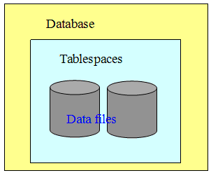
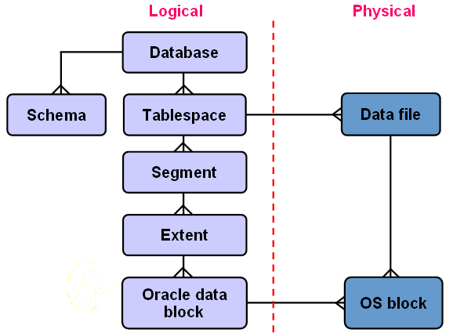

# Oracle表空间（tablespaces）

* oarcle数据库真正存放数据的是`数据文件`（data files）
* Oarcle表空间（tablespaces）是一个逻辑的概念，在物理上是并不存在
* 把一组data files 放在在一起就成为一个表空间

## 表空间属性：

* 一个数据库可以包含多个表空间，一个表空间只能属于一个数据库
* 一个表空间包含多个数据文件，一个数据文件只能属于一个表空间

* 逻辑的角度
	* 一个数据库（database）下面可以分多个表空间（tablespace）
	* 一个表空间下面又可以分多个段（segment）
	* 一个数据表要占一个段（segment）
	* 一个索引也要占一个段（segment ）
	* 一个段（segment）由多个 区间（extent）组成，
	* 一个区间由一组连续的数据块（data block）组成。
	* 这连续的数据块是在逻辑上是连续的，有可能在物理磁盘上是分散。
* 物理角度
	* 一个表空间由多个数据文件组成，数据文件是实实在在存在的磁盘上的文件
	* 这些文件是由oracle数据库操作系统的block组成的
	