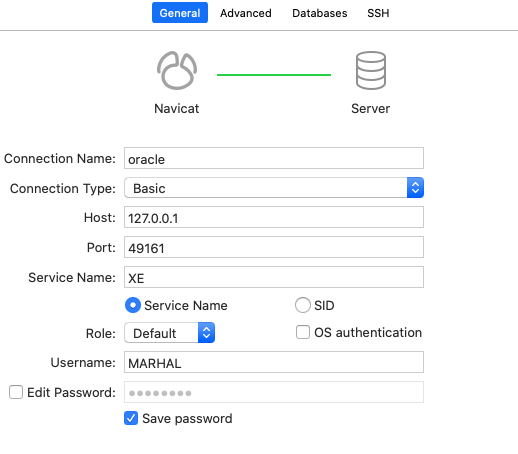

# docker 安装 Oracle

```bash

# 搜索镜像
docker search docker-oracle-xe-11g

# 安装镜像
docker pull deepdiver/docker-oracle-xe-11g

# 安装oracle容器
docker run -d -p 1521:1521 --name oracle11g deepdiver/docker-oracle-xe-11g
# 或
docker run -h "oracle" --name "oracle" -d -p 49160:22 -p 49161:1521 -p 49162:8080 deepdiver/docker-oracle-xe-11g

# 进入容器
docker exec -it oracle11g bash

# 通过sqlplus进入Oracle
root@727414867a10:/# sqlplus system/oracle

# 查看数据库用户名和密码
SQL> select username,password from dba_users;
# USERNAME		       PASSWORD
# ------------------------------ ------------------------------
# SYS
# ANONYMOUS
# AUTOTEST
# SYSTEM
# APEX_PUBLIC_USER
# APEX_040000
# OUTLN
# XS$NULL
# FLOWS_FILES
# MDSYS
# CTXSYS
# 
# USERNAME		       PASSWORD
# ------------------------------ ------------------------------
# XDB
# HR
# 
# 13 rows selected.

# 创建用户MARHAL密码为123456（简易）
SQL> CREATE USER MARHAL IDENTIFIED BY 123456;

# 查看所有用户
SQL> SELECT * FROM ALL_USERS;

# 赋权
SQL> GRANT CONNECT, RESOURCE, DBA TO MARHAL;
# ******* DBA: 拥有全部特权，是系统最高权限，只有DBA才可以创建数据库结构。
# ******* RESOURCE:拥有Resource权限的用户只可以创建实体，不可以创建数据库结构。
# ******* CONNECT:拥有Connect权限的用户只可以登录Oracle，不可以创建实体，不可以创建数据库结构。
# ******* 对于普通用户：授予connect, resource权限。
# ******* 对于DBA管理用户：授予connect，resource, dba权限。
# ******* 系统权限只能由DBA用户授出：sys, system(最开始只能是这两个用户)
# 退出
SQL> exit;

# 登录
root@727414867a10:/# sqlplus
# Enter user-name: MARHAL
# Enter password: 
# 
# Connected to:
# Oracle Database 11g Express Edition Release 11.2.0.2.0 - 64bit Production
# 
# SQL> 

```

# Navicat 连接
