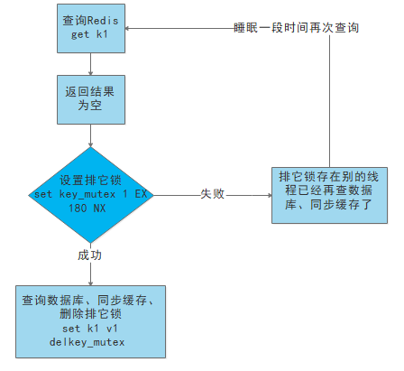

# 缓存穿透

## 问题描述

* key对应的数据在数据源并不存在，每次针对此key的请求从缓存获取不到，请求都会压到数据源，从而可能压垮数据源。
* 比如用一个不存在的id信息，不论缓存还是数据库都没有，若黑客利用此漏洞进行攻击可能压垮数据库。

## 解决方案

* `对空值缓存`：如果一个查询返回的数据为空（不管是数据是否不存在），我们仍然把这个空结果（null）进行缓存，设置空结果的过期时间会很短，最长不超过五分钟
* `设置可访问的名单（白名单）`：
使用bitmaps类型定义一个可以访问的名单，名单id作为bitmaps的偏移量，每次访问和bitmap里面的id进行比较，如果访问id不在bitmaps里面，进行拦截，不允许访问。
* `采用布隆过滤器`：(布隆过滤器（Bloom Filter）是1970年由布隆提出的。它实际上是一个很长的二进制向量(位图)和一系列随机映射函数（哈希函数）。
布隆过滤器可以用于检索一个元素是否在一个集合中。它的优点是空间效率和查询时间都远远超过一般的算法，缺点是有一定的误识别率和删除困难。)
将所有可能存在的数据哈希到一个足够大的bitmaps中，一个一定不存在的数据会被 这个bitmaps拦截掉，从而避免了对底层存储系统的查询压力。
* `进行实时监控`：当发现Redis的命中率开始急速降低，需要排查访问对象和访问的数据，和运维人员配合，可以设置黑名单限制服务

# 缓存击穿

## 问题描述

* key对应的数据存在，但在redis中过期，此时若有大量并发请求过来，这些请求发现缓存过期一般都会从后端DB加载数据并回设到缓存，这个时候大并发的请求可能会瞬间把后端DB压垮。

## 解决方案

* `预先设置热门数据`：在redis高峰访问之前，把一些热门数据提前存入到redis里面，加大这些热门数据key的时长
* `实时调整`：现场监控哪些数据热门，实时调整key的过期时长
* `使用锁`：
    * 就是在缓存失效的时候（判断拿出来的值为空），不是立即去load db。
    * 先使用缓存工具的某些带成功操作返回值的操作（比如Redis的SETNX）去set一个mutex key
    * 当操作返回成功时，再进行load db的操作，并回设缓存,最后删除mutex key；
    * 当操作返回失败，证明有线程在load db，当前线程睡眠一段时间再重试整个get缓存的方法。

# 缓存雪崩

## 问题描述

* key对应的数据存在，但在redis中过期，此时若有大量并发请求过来，这些请求发现缓存过期一般都会从后端DB加载数据并回设到缓存，这个时候大并发的请求可能会瞬间把后端DB压垮。
* 缓存雪崩与缓存击穿的区别在于**缓存雪崩**针对很多key缓存，**缓存击穿**则是某一个key正常访问

## 解决方案

* `构建多级缓存架构`：nginx缓存 + redis缓存 +其他缓存（ehcache等）
* `使用锁或队列`：用加锁或者队列的方式保证来保证不会有大量的线程对数据库一次性进行读写，从而避免失效时大量的并发请求落到底层存储系统上。不适用高并发情况
* `设置过期标志更新缓存`：记录缓存数据是否过期（设置提前量），如果过期会触发通知另外的线程在后台去更新实际key的缓存。
* `将缓存失效时间分散开`：原有的失效时间基础上增加一个随机值，如1-5分钟随机，这样每一个缓存的过期时间的重复率就会降低，就很难引发集体失效的事件。

