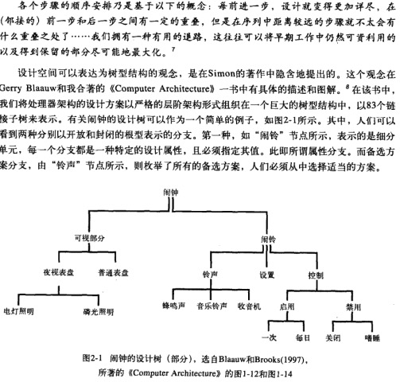

# 设计之模型

## 第一章 `设计的疑问`

### 培根理论：
* (新思想来自于)将对一门艺术的领悟联系并应用到另一门艺术中，李竟若干次这样的精力而有所悟，脑海里自然就孕育出了新思想

### 什么是设计
* 对.......形成计划或模式，运用思维整理或考量.......以便后续执行
* 英国作家、戏剧家Dorothy Sayers的创作三阶段
	* 构想（Idea） - 概念性构想的形成
	* 精神（Energy） / 实现（Implementation）- 在真实的媒体中实现
	* 交互（Interaction）- 在真实的体验中与用户交互

### 设计的价值所在
* 在设计对话中将不可见的设计概念转化为真正的实体会带来积极的价值
	* 良好的设计具有概念性的完整性-----统一、经济、清晰
	* 概念的统一是一种目标，只有通过大量的会话才能达到
	* 关注细节。将不同版本的概念之间的冲突暴露出来并迫使其得到解决

### 设计类别
* 常规（例行设计）
* 适应性（改造设计）
* 原创设计 - **重点**

## 第二章 `理性模型`
### 模型概览
* 目标
	* 目标或目的

* 必要条件
	* 和主要目标相关的是一组必要条件或次要目的

* 效用函数
	* 为若干必要条件依其重要性加权，以对设计进行优化

* 约束
	* 每种设计和优化都是会受到一些约束限制
	* 二元约束
		* 只有满足或不满足的结果
	* 弹性约束
		* 在接近限额的时候所付出的代价会急剧增加
	* 简单约束
		* 在不经意间隐藏着令人生畏的复杂性

* 资源分配、预算和关键预算
	* 许多约束的形式是固定资源在各个设计要素之间的分配

* 设计树
	* 按照理性模型的思路，形成设计决策
	* 设计的过程可以认为是一种对于以树形结构组织的设计空间的系统化探索

### 构思来源

### 理性模型的长处

* 为设计项目的规划提供了清晰的步骤
* 为日程规划和进度评估定义了明确的里程碑
* 为项目组织和人员配备指明了方向
* 改进了设计团队的内部沟通
* 新手很容易就可以上手
* 有助于避免团队陷于举棋不定的局面，促使团队形成关于项目宗旨的同一认识
* 工作开始之前做好设计过程规划，能够避免大量麻烦，也避免白费努力
* 对于设计空间的系统化搜索，拓宽设计师的个人眼界，并远超先前的个人经验

## 第三章 `理性模型的缺陷`

### 初始阶段不真正明确目标
* 设计中最困难的部分在于决定要设计什么
* 为客户提供的最有用的服务是帮助他决定什么是他真正想要的
### 不知晓设计树的样子 --- 一边设计一遍探索
### 设计树借点不是在设计决策，而是设计暂定方案
### 有用性函数无法以增量方式求值
* 经验估算
* 简单估算量
### 必要条件及其权重在持续变化
### 约束在持续变化
### 其他
* 理性模型是一种自然的思维模型
* 设计师根本不那样做事
* 作者观点：摒弃瀑布模型
## 第四章 `需求、罪念以及合同`

### 需求

* 通常没有人在需求制订过程中为产品本身一一为其概念完整性、高效性和健壮性摇旗呐喊
* 只有架构师或者工程师会，但是只会根据自己的品味和直觉，还未能掌握以事实为依据来说服他人
* 在经典的基于瀑布模型的产品过程中，需求是在设计开始之前就确定了的
* 醒目既未排定优先级，也未赋以权重

---

* 在实践中，产品设计师会根据各自的用户模型对官方需求做出自身的隐式加权评估， 
* 若未做好加权工作，会造成设计师、深度用户、若干需求定制者确实拥有的领域知识之间的脱钩

---

#### 抵制需求膨胀和蠕变

* 需求激增现象必须予以钳制
  * 将需求蠕变作为头等大事来抓   
  * 及早人名手腕强硬、经验丰富、领域知识到位的经理
  * `以其认为必要的方式度身定制标准流程和步骤`
  * 敦促应用需求追踪矩阵以确保每一个被精化、定义和列出的需求都的确是从一个或多个的初始的总体需求中派生出来的
    
### 罪念

* 无法信任彼此的动机
* 无法保证沟通的到位

### 合同

* 需要书面洗衣来在共同过程中作澄清
* 需要具有强制执行力的合同来保护自己不受他人或自身的影响
* 迫使目标、需求和约束在过早的阶段就确定下来是合同的要素

### 合同模型

## 第五章 `好的设计过程模型`

### 要有一个占主导地位的模型

* 强调设计需求的递进式探索和演化
* 能够令人印象深刻地可视化，从而使得它们可以被团队和礼仪攸关者很容易接受和理解
* 可以促进合同的达成

---

### 共同演化模型

* Maher、Poon和Boulanger提出了一个正规的模型
* 将构造问题本身，以及寻找解法的思路这两者的研发和完 善过程齐头并进，辅以分析、综合和评估过程在两个想象中的设计“空间”（问题空间和解空间之间）地不断迷代

#### 笔者表述

* 强调了对于需求的递进式探索和构造
* 没有伪装成将设计-构建-测试-部署-维护-扩展这些过程的所有方面都包含在内的样子
* 该模型的几何图像也没有示意一个收敛的过程
* 模型尚未进行 大量的后续研发工作
* 在它原始的构造形态中，并没有表示阶段里程碑和合同的节点
* 该模型有它的闪光点，也比理性模型要好，但作者并不认为它已经充分完整

### Raymond的集市模型

* 成就：引领了Linux的操作系统的开发工作
* 表述：在用户与生产者社区中，某个成员发现了一个需要, 然后开发出一个模块来满足它，井将该模块作为礼物提供给他的同伴使用
* 应用：某个成员在他所使用的模块中检测出一个缺陷，然后把它 修复以使自己能完成手头的工作，尔后他就把这个修复成果作为礼物提供给社区

#### 优势
* 从进化的视角来看，市场机制起到了选择拥有最佳设计的模块的作用
* 将一个新的模块同时放到数百个测试者那里，会更快地发现其中的缺陷，从而催生更加可靠的产品
* 缺陷被修复得更好，因为市场化的选择机制同样作用于缺陷修复过程

### Boehm的螺旋模型

* 它将同一活动的连续反复彼此关联起来
* 该模型强调的是原型方法
* 原始提案中，对于需求的渐进式探索有其位置但并未被强调，它也未能强调合同达成的节点

---

