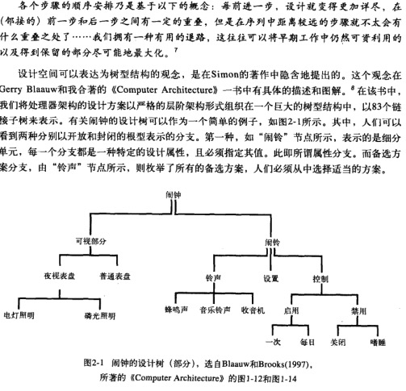

# 设计之模型

## 第一章 `设计的疑问`

### 培根理论：
* (新思想来自于)将对一门艺术的领悟联系并应用到另一门艺术中，李竟若干次这样的精力而有所悟，脑海里自然就孕育出了新思想

### 什么是设计
* 对.......形成计划或模式，运用思维整理或考量.......以便后续执行
* 英国作家、戏剧家Dorothy Sayers的创作三阶段
	* 构想（Idea） - 概念性构想的形成
	* 精神（Energy） / 实现（Implementation）- 在真实的媒体中实现
	* 交互（Interaction）- 在真实的体验中与用户交互

### 设计的价值所在
* 在设计对话中将不可见的设计概念转化为真正的实体会带来积极的价值
	* 良好的设计具有概念性的完整性-----统一、经济、清晰
	* 概念的统一是一种目标，只有通过大量的会话才能达到
	* 关注细节。将不同版本的概念之间的冲突暴露出来并迫使其得到解决

### 设计类别
* 常规（例行设计）
* 适应性（改造设计）
* 原创设计 - **重点**

## 第二章 `理性模型`
### 模型概览
* 目标
	* 目标或目的

* 必要条件
	* 和主要目标相关的是一组必要条件或次要目的

* 效用函数
	* 为若干必要条件依其重要性加权，以对设计进行优化

* 约束
	* 每种设计和优化都是会受到一些约束限制
	* 二元约束
		* 只有满足或不满足的结果
	* 弹性约束
		* 在接近限额的时候所付出的代价会急剧增加
	* 简单约束
		* 在不经意间隐藏着令人生畏的复杂性

* 资源分配、预算和关键预算
	* 许多约束的形式是固定资源在各个设计要素之间的分配

* 设计树
	* 按照理性模型的思路，形成设计决策
	* 设计的过程可以认为是一种对于以树形结构组织的设计空间的系统化探索

### 构思来源

## 第三章

## 第四章

## 第五章