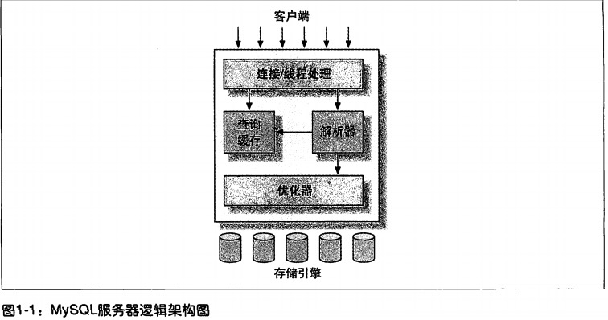
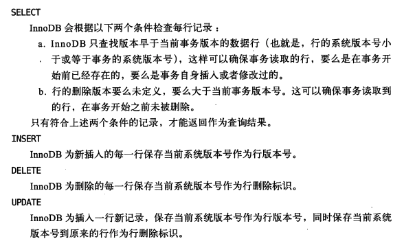

- [第一章.MySQL架构与历史](#1)
	- [MySQL逻辑架构](#1.1)
	- [并发控制](#1.2)
	- [事务](#1.3)
	- [多版本并发控制](#1.4)
	- [MySQL的存储引擎](#1.5)
	- [MySQL时间线(Timeline)](#1.6)
	- [MySQL的开发模式](#1.7)
	- [总结](#1.8)


# <a id="1">MySQL架构与历史</a>

## <a id="1.1">1.1-MySQL逻辑架构</a>



* 最上层：大多基于网络的客户端/服务器的工具挥着服务都有类似的架构（如：链接处理、授权认证、安全等）
* 第二层: mysql核心功能。
	* 包括`查询解析`、`分析`、`优化`、`缓存`以及所有的`内置函数`(时间、日期、数学和加密函数)。
	* 所有跨存储引擎的功能都在这一层实现：`存储过程`、`触发器`、`视图`等
* 第三层：包含了存储引擎。
	* 存储引擎负责mysql中数据的存储和提取
	* 服务器通过api与存储引擎通信
	* 存储引擎不会解析sql（innodb例外，她会解析外键定义，因为mysql服务器本身没有实现该功能）
	* 不同的存储引擎不会相互通信，只是简单地响应上层服务器的请求

### 1.1.1 连接管理与安全性
* 每个客户端连接都会在服务器进程中拥有一个线程，该连接的查询只会在这个单独的线程中执行
* 连接mysql服务器认证
	* 基于用户名、原始主机信息和密码
	* 如果用了安全套接字（SSL）方式，还可以使用X.509证书认证
	* 连接成功后服务器会验证客户端执行操作的权限

### 1.1.2 优化与执行
* mysql解析查询&创建内部数据结构 -> 优化（重写查询、决定表的读取顺序、选择合适和索引）-> 执行
* select查询
	* 检查到查询缓存(Query Cache) -> 直接返回结果集
	* 未检查到查询缓存->查询解析->优化->执行

## <a id="1.2">1.2-并发控制</a>
* 只要有多个查询需要`在同一时刻修改数据`，都会产出并发控制的问题
* mysql在两个层面的并发控制：`服务器层`、`存储引擎层`

### <a id="1.2.1">读写锁</a>
* 共享锁(读锁)
    * 共享的，相互不阻塞的。多个客户可在同一时刻可以同时读取一个资源而互不干扰。
* 排他锁(写锁)
    * 一个写锁会阻塞其他的写锁和读锁

### <a id="1.2.1">锁粒度</a>
* 表锁（table lock）
    * mysql中最基本的锁策略，`开销最小`的策略
    * 锁定整张表
    * 用户对表就行写操作前，需要先获得写锁，这回阻塞其他用户对表的所有读写操作。
    * 在使用`ALTER TABLE`之类操作时会使用表锁而忽略存储引擎的锁机制
* 行级锁（row lock）
    * 可以最大程度地支持并发处理，同时也带来了`最大的锁开销`
    * 只在存储引擎实现，mysql服务器层没有实现
    
## <a id="1.3">1.3-事务</a>
* 事务就是一组原子性的sql查询，或者说一个独立的工作单元
* 事务内的语句，要么全部执行，要么全部执行失败

### 事务的`ACID`
* **原子性**（atomicity）
    * 一个事务必须被视为一个`不可分割的最小工作单元`
    * 整个事务中的所有操作要么全部提交成功，要么全部失败回滚
* **一致性**（consistency）
    * 数据库总是从一个一致性的状态转换到另外一个一致性的状态
    * 事务最终没有提交，事务中锁座的修改也不会保存在数据库中
* **隔离性**（isolation）
    * 通常一个事务所做的修改在最终提交之前，对其他事务是不可见的
    * 事务的`隔离级别`（isolation level）
* **持久性**（durability）
    * 一旦事务提交，则其锁座的修改就会永久保存到数据库中
    
### <a id="1.3.1">隔离级别</a>

```sql
-- 8.0版本

show variables like '%isolation%';
# +-----------------------+-----------------+
# | Variable_name         | Value           |
# +-----------------------+-----------------+
# | transaction_isolation | REPEATABLE-READ |
# +-----------------------+-----------------+


select @@global.transaction_isolation,@@transaction_isolation;
+--------------------------------+-------------------------+
| @@global.transaction_isolation | @@transaction_isolation |
+--------------------------------+-------------------------+
| REPEATABLE-READ                | REPEATABLE-READ         |
+--------------------------------+-------------------------+
```

* **READ UNCOMMITTED (未提交读)**
    * 事务中的修改即使没有提交，对其他事务也都是可见的
    * 事务可以读取未提交的数据，被称为`脏读`
    * 实际应用中一般很少使用
* **READ COMMITTED (提交读)**
    * 大多数数据库系统的默认隔离级别（mysql不是）
    * 又称`不可重复读`
    * 一个事务从开始到提交之前，所做的任何修改对其他事务都是不可见的
* **REPEATABLE READ (可重复读)**
    * mysql的`默认事务隔离级别`
    * 解决了`脏读`的问题
    * 保证了在同一个事务中多次读取同样的记录的结果是一致的
    * 还是无法解决`幻读`（***当某个事务在读取某个范围内的记录是，另外一个又在改范围插入了新的记录，当之前的事务再次读取该范围的记录时没回产生幻行***）的问题
    * InnoDB和XtraDB存储引擎通过多版本并发控制(MVCC)解决了幻读的问题
* **SERIALIZABLE (可串行化)**
    * `最高的隔离级别`
    * 通过强制事务串行执行，避免了`幻读`的问题
    * 在读取的每一行数据都加锁，所以可能导致大量的超时和锁争用的问题
    * 只有在非常需要确保数据的一致性而且可以接受没有并发的情况下，才考虑使用

| 隔离级别 | 脏读可能性 | 不可重复读可能性 | 幻读可能性 | 加锁读 |
| :---: | :----: | :----: | :----: |:----: |
|READ UNCOMMITTED | yes| yes | yes | no |
|READ COMMITTED |no|yes|yes|no|
|REPEATABLE READ |no|no|yes|no|
|SERIALIZABLE |no|no|no|yes|

### <a id="1.3.2">死锁</a>

* 死锁是指两个或者多个事务在同一资源上相互占用，并请求锁定对方占用的资源，从而导致恶性循环的现象。
* 当多个事务试图以不同的顺序锁定资源时，就可能产生死锁
* 多个事务同事锁定同一个资源时，也会产生死锁。

---
**解决**
* 1.检测到死锁的循环依赖，并立即返回一个错误
* 2.查询时间达到锁等待超时的设定后放弃锁请求（不好的处理方式）
* innodb目前处理方法：将持有最少行级排他锁的事务进行回滚

---
**分析**
* 锁的行为和顺序是和存储引擎相关的
* 死锁的原因：
    * 有些事因为`真正的数据冲突`
    * 有些则完全是由于存储引擎的实现方式导致的
* 死锁发生后，只有部分或者回滚其中一个事务，才能打破死锁
* 在`应用程序设计`时必须考虑如何处理死锁

### <a id="1.3.3">事务日志</a>
* 事务日志可以帮助提高事务的效率
* 存储引擎在修改表数据时只需修改其内存拷贝再把该修改行为记录到持久在硬盘上的事务日志中，而不用每次都将修改的数据本身持久到磁盘
* 事务日志采用的是`追加`的方式,写日志的操作是`磁盘上一小块区域内的顺序I/O`
* **预写式日志** 事务日志持久以后，内存中修改的数据在后台可以慢慢刷回到磁盘，修改数据需要写两次磁盘

### <a id="1.3.4">Mysql中的事务</a>
#### 1.自动提交（AUTOCOMMIT）
* mysql的默认模式
* 在 **数据定义语言(DDL)**[`alter table`、`lock tables`]中，在执行之前会强制提交当前的活动事务
* 设置
```mysql
-- 查看自动提交模式
show variables like 'AUTOCOMMIT';
-- 设置`启用`自动提交模式
set AUTOCOMMIT = 1;
-- 设置`禁用`自动提交模式
set AUTOCOMMIT = 1;

-- 设置的隔离级别会在下一个事务生效
set transaction isolation level read committed ;
set transaction isolation level read uncommitted ;
set transaction isolation level repeatable read ;
set transaction isolation level serializable ;
-- 只改变当前会话的隔离级别
set session transaction isolation level read committed ;
set session transaction isolation level read uncommitted ;
set session transaction isolation level repeatable read ;
set session transaction isolation level serializable ;
```
#### 2.在事务中混合使用存储引擎
* mysql服务器层不管理事务，事务由下层的存储引擎实现的，在同一事务中使用多种存储引擎是不可靠的
* 事务中混合使用了事务型(innnodb)和非事务型(myisam)的表，可以正常提交，但是只能回滚事务型表的数据。

#### 3. 隐式和显式锁定
* innodb才用的是`两阶段锁定协议`
* 隐式锁定：事务执行过程中，随时都可以执行锁定，只用在执行commit和rollback时`所有的锁`会`在同一时刻`被释放
* 显式锁定：通过特定的语句进行(不属于sql规范)
```sql
select ... lock in share mode ;
select ... for update ;
```
## <a id="1.4">1.4-多版本并发控制(MVCC)</a>
* MVCC是行级锁的一个变种，在很多情况下避免了加锁操作，因此开销更低
* MVCC大都实现了非阻塞的操作，写操作也只锁定必要的行。
* MVCC的实现式通过`保存数据在某个时间点的快照`来实现的
* 不同存储引擎的MVCC实现是不同的

### InnoDB的MVCC
* 通过在每行记录的后面保存两个隐藏的列--行的创建时间和过期时间（存储的不是实际的时间值而是系统版本号）
* 每开始一个新的事务，系统版本号都会自动递增
* MVCC 只在`REPEATABLE READ` 和 `READ COMMITTED` 两个隔离级别工作。
    * `READ UNCOMMITTED`总是读取最新的数据行而不是符合当前事务版本的数据行。
    * `SERIALIABLE` 会对所有读取的行都加锁
* repeatable read（可重复读）下 MVCC 的操作

* 优点：大多数读操作不用加锁，使得读数据操作简单并且性能很好，也能保证读取到符合标准的行
* 缺点：每行记录都需要额外的存储空间，需要更多的行检查工作，和额外的维护工作

## <a id="1.5">1.5 - MySQL的存储引擎</a>

* MySQL使用文件系统的目录和文件来保存数据库和表的定义，大小写敏感性和具体的平台相关。
    * MySQL将每个数据库(schema)保存为数据目录下的一个子目录 (/data/<yourDatabaseName>)
    * 在<yourDatabaseName>数据库中建表,会在数据库子目录创建一个和表名相同的.frm文件来保存表的定义。(/data/<yourDatabaseName>/<yourTableName>.frm)
* 查看表的相关信息

```sql
mysql> use mysql
mysql> show table status like 'user'\G;
# *************************** 1. row ***************************
#            Name: user 
#          Engine: MyISAM
#         Version: 10
#      Row_format: Dynamic
#            Rows: 4
#  Avg_row_length: 128
#     Data_length: 512
# Max_data_length: 281474976710655
#    Index_length: 4096
#       Data_free: 0
#  Auto_increment: NULL
#     Create_time: 2021-08-09 11:47:15
#     Update_time: 2021-08-09 11:47:39
#      Check_time: NULL
#       Collation: utf8_bin
#        Checksum: NULL
#  Create_options: 
#         Comment: Users and global privileges
# 1 row in set (0.00 sec)
```
* 解析
    * Name：
    * Engine：
    * Row_format：行的格式
        * MyISAM 的可选值：Dynamic、Fixed、Compressed。
            * Dynamic ： 行长度可变，一般包含可变长度的字段。(VACHAR/BLOB)
            * Fixed: 行长固定，只包含固定长度的列(CAHR / INTEGER)
            * Compressed: 行只在压缩表中存在
    * Rows ： 表中的行数
        * MyISAM：该值为精确值
        * InnoDB：估计值
    * Avg_row_length： 平均每行包含的字节数
    * Data_length：表数据的大小（单位：字节）
    * Max_data_length：表数据的最大容量（改值和存储引擎有关）
    * Index_length：索引的大小
    * Data_free：已分配但目前没有使用的空间，包含之前删除的行和后续可以被insert利用到的空间
    * Auto_increment：下一个自增的值
    * Create_time：
    * Update_time：
    * Check_time：使用`CHECK TABLE`或`myisamchk`工具最后一次检查表的时间
    * Collation：字符集合字符列排序规则
    * Checksum：如果启用，保存的是整个表的实时校验和
    * Create_options：创建表时指定的其他选项
    * Comment：额外信息
### <a id="1.5.1">InnoDB 存储引擎</a>

* InnoDB的数据存储在表空间(tablespace)中，tablespace是由InnoDB管理的一个黑盒子，由一系列的数据文件组成
* 才用`MVCC`来支持高并发，实现了四个标准的隔离级别，默认的是`REPEATABLE READ(可重复读)`, 并且通过`(next-key locking)间隙锁`策略防止幻读的出现。
    * 间隙锁使得innodb 不仅仅锁定查询涉及的行，还会对索引中的间隙进行锁定，以防止幻影行的插入
* InnoDB 表是基于`聚簇索引`建立的。
    * 聚簇索引对之间查询有很高的性能
    * 它的二级索引必须包含主键列
* InnoDB 的存储格式是平台独立的
* InnoDB 内部优化

### <a id="1.5.2">MyISAM 存储引擎</a>
* mysql 5.1及以前版本的默认存储引擎
* 不支持事务和行级锁，且崩溃后无法安全恢复
* 存储
    * 表存储在两个文件：数据文件(.MYD)和索引文件(.MYI)
    * 表可以包含静态(长度固定)或动态行，mysql会根据表的定义来决定采用何种行格式
    * 表可以存储行的记录数，一般受限于可用的磁盘空间或操作系统中单个文件的最大尺寸
* 特性
    * 加锁与并发
        * 对`整张表`加锁
        * 读取是会对表加`共享锁`，写入时加`排他锁`
        * `并发插入(CONCURRENT INSERT)`：在读取查询表的同时可以插入新的记录
    * 修复
        * 可以手工或者自动执行检查和修复，速度慢可能会导致数据丢失
        * `CHECK TABLE xxx` 有错误可以通过 `REPAIR TABLE xxx`进行修复
        * mysql服务器关闭时可用`myisamchk`命令行工具进行检查和修复
    * 索引特性
        * 对长字段(BLOB、TEXT等)支持基于前500个字符创建索引
        * 支持全文索引
    * 延迟更新索引键
        * 建表是指定了 `DELAY_KEY_WRITE` 选项，在每次修改完成时会将修改的索引数据写到内存中的`键缓冲区`
        * 只有在`清理键缓冲区`或者`关闭表`的时候才将对应索引块写入磁盘
        * 极大提`升写入性能`，但是在库或主机崩溃时会造成索引损坏，需要执行修复操作
* MyISAM 压缩表
    * 适用于表导入数据后不会进行修改操作
    * 修改压缩表需要先将表解除压缩，修改，再压缩
    * 极大减少磁盘空间占用和磁盘I/O,提升查询性能
    * 支持索引，索引只读
    * 压缩表的记录是独立压缩，读取单行不需要解压整个表
* MyISAM 性能
    * 最典型的性能问题 ： 表锁

### <a id="1.5.3">其他内置存储引擎</a>
* Archive：只支持insert和select
* Blackhole：丢弃所有插入的数据，服务器会记录Blackhole表的日志，适用于一些特殊的复制架构和日志审核
* CSV：将普通的csv文件作为mysql表处理，不支持索引
* NDB集群引擎


## <a id="1.6">MySQL时间线(Timeline)</a>
## <a id="1.7">MySQL的开发模式</a>
## <a id="1.8">总结</a>

